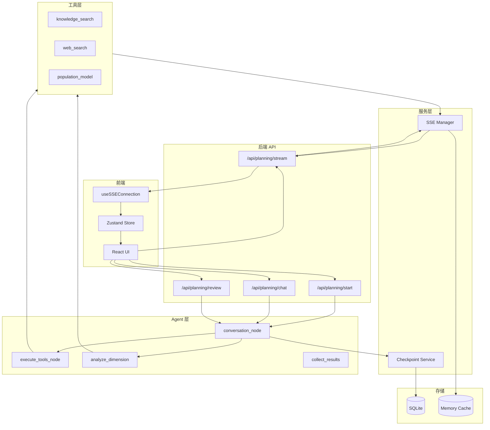

# 术语表与交叉引用

本文档提供系统术语定义和文档间交叉引用，确保概念一致性。

## 核心术语

### 会话与状态

| 术语 | 英文 | 定义 | 相关文档 |
|------|------|------|----------|
| Session | Session | 一次完整的规划会话，由唯一 session_id 标识，包含所有对话和规划状态 | [后端API](./backend-api-dataflow.md) |
| Checkpoint | Checkpoint | LangGraph 的状态快照，用于持久化和恢复执行 | [Agent核心](./agent-core-implementation.md) |
| Phase | Phase | 规划阶段，包括 init、layer1、layer2、layer3、completed | [Agent核心](./agent-core-implementation.md) |
| SSOT | Single Source of Truth | 单一数据来源，指 Checkpoint 作为状态的唯一真实来源 | [后端API](./backend-api-dataflow.md) |

### 层级与维度

| 术语 | 英文 | 定义 | 相关文档 |
|------|------|------|----------|
| Layer | Layer | 规划层级，包括 Layer 1（现状分析）、Layer 2（规划思路）、Layer 3（详细规划） | [维度数据流](./layer-dimension-dataflow.md) |
| Dimension | Dimension | 分析维度，每个层级包含多个维度，如区位分析、社会经济分析等 | [维度数据流](./layer-dimension-dataflow.md) |
| Wave | Wave | 执行波次，同一层级内存在依赖的维度按 Wave 顺序执行 | [维度数据流](./layer-dimension-dataflow.md) |
| Report | Report | 维度分析结果，存储在 reports 状态中 | [Agent核心](./agent-core-implementation.md) |

### SSE 事件

| 术语 | 英文 | 定义 | 相关文档 |
|------|------|------|----------|
| SSE | Server-Sent Events | 服务端推送事件，用于实时传输规划进度 | [前端状态](./frontend-state-dataflow.md) |
| dimension_start | Dimension Start | 维度开始分析事件 | [后端API](./backend-api-dataflow.md) |
| dimension_delta | Dimension Delta | 维度内容增量事件，用于流式传输 | [前端状态](./frontend-state-dataflow.md) |
| dimension_complete | Dimension Complete | 维度分析完成事件 | [后端API](./backend-api-dataflow.md) |
| layer_started | Layer Started | 层级开始执行事件 | [后端API](./backend-api-dataflow.md) |
| layer_completed | Layer Completed | 层级执行完成事件 | [后端API](./backend-api-dataflow.md) |
| tool_call | Tool Call | 工具开始执行事件 | [工具系统](./tool-system-implementation.md) |
| tool_progress | Tool Progress | 工具执行进度事件 | [工具系统](./tool-system-implementation.md) |
| tool_result | Tool Result | 工具执行结果事件 | [工具系统](./tool-system-implementation.md) |

### Agent 架构

| 术语 | 英文 | 定义 | 相关文档 |
|------|------|------|----------|
| Router Agent | Router Agent | 采用中央路由模式的 Agent 架构，conversation_node 作为路由中心 | [Agent核心](./agent-core-implementation.md) |
| StateGraph | StateGraph | LangGraph 的状态图，定义节点和边的执行流程 | [Agent核心](./agent-core-implementation.md) |
| Send API | Send API | LangGraph 的并行分发机制，用于同时启动多个维度分析 | [Agent核心](./agent-core-implementation.md) |
| Intent Router | Intent Router | 意图路由，根据 LLM 响应决定下一步执行 | [Agent核心](./agent-core-implementation.md) |

### 前端状态

| 术语 | 英文 | 定义 | 相关文档 |
|------|------|------|----------|
| Zustand | Zustand | React 状态管理库，配合 Immer 实现不可变更新 | [前端状态](./frontend-state-dataflow.md) |
| PlanningState | PlanningState | 前端状态接口，包含所有规划相关状态 | [前端状态](./frontend-state-dataflow.md) |
| deriveUIState | Derive UI State | 从核心状态派生 UI 状态的函数 | [前端状态](./frontend-state-dataflow.md) |
| Signal-Fetch | Signal-Fetch | SSE 发送信号、REST API 获取完整数据的模式 | [前端状态](./frontend-state-dataflow.md) |

### 工具系统

| 术语 | 英文 | 定义 | 相关文档 |
|------|------|------|----------|
| ToolRegistry | Tool Registry | 工具注册中心，管理工具函数和元数据 | [工具系统](./tool-system-implementation.md) |
| ToolMetadata | Tool Metadata | 工具元数据，包含名称、描述、参数 Schema 等 | [工具系统](./tool-system-implementation.md) |
| RAG | Retrieval-Augmented Generation | 检索增强生成，知识检索工具的核心技术 | [工具系统](./tool-system-implementation.md) |

---

## 文档交叉引用矩阵

| 文档 | 前端状态 | 后端API | Agent核心 | 维度数据流 | 工具系统 |
|------|:--------:|:-------:|:---------:|:----------:|:--------:|
| [前端状态管理](./frontend-state-dataflow.md) | - | ✓ | ✓ | ✓ | |
| [后端API与数据流](./backend-api-dataflow.md) | ✓ | - | ✓ | | ✓ |
| [Agent核心实现](./agent-core-implementation.md) | ✓ | ✓ | - | ✓ | ✓ |
| [维度与层级数据流](./layer-dimension-dataflow.md) | ✓ | | ✓ | - | ✓ |
| [工具系统实现](./tool-system-implementation.md) | | ✓ | ✓ | ✓ | - |

---

## 数据流总览

### 完整数据流



### 状态传递链

```
用户输入
    ↓
LangGraph State (UnifiedPlanningState)
    ↓
conversation_node (LLM 处理)
    ↓
intent_router (意图路由)
    ↓
┌──────────────────────────────────────────┐
│ route_by_phase (规划路由)                │
│     ↓                                    │
│ Send API (并行分发)                      │
│     ↓                                    │
│ analyze_dimension × N (维度分析)         │
│     ↓                                    │
│ dimension_results (自动合并)             │
│     ↓                                    │
│ collect_results (结果收集)               │
│     ↓                                    │
│ reports 更新                             │
└──────────────────────────────────────────┘
    ↓
SSE Events (发送到前端)
    ↓
Zustand Store (状态更新)
    ↓
React UI (重新渲染)
```

---

## 命名约定

### 代码命名

| 类型 | 命名约定 | 示例 |
|------|----------|------|
| 维度键 | snake_case | `socio_economic`, `land_use_planning` |
| 工具名称 | snake_case | `knowledge_search`, `accessibility_analysis` |
| SSE 事件类型 | snake_case | `dimension_start`, `layer_completed` |
| 状态字段 | snake_case | `pause_after_step`, `previous_layer` |
| 函数名 | snake_case | `analyze_dimension`, `collect_layer_results` |
| 类名 | PascalCase | `ToolRegistry`, `SSEManager` |
| 接口名 | PascalCase | `PlanningState`, `ToolMetadata` |

### 文件命名

| 类型 | 命名约定 | 示例 |
|------|----------|------|
| Python 模块 | snake_case | `dimension_metadata.py`, `sse_publisher.py` |
| TypeScript 组件 | PascalCase | `PlanningProvider.tsx` |
| TypeScript Hook | camelCase + use 前缀 | `useSSEConnection.ts` |
| 文档 | kebab-case | `frontend-state-dataflow.md` |

---

## API 端点速查

| 端点 | 方法 | 功能 |
|------|------|------|
| `/api/planning/start` | POST | 启动新规划会话 |
| `/api/planning/stream/{session_id}` | GET | SSE 事件流 |
| `/api/planning/status/{session_id}` | GET | 获取会话状态 |
| `/api/planning/chat/{session_id}` | POST | 发送对话消息 |
| `/api/planning/review/{session_id}` | POST | 审查操作 (approve/reject) |
| `/api/planning/checkpoint/{session_id}` | GET | 获取检查点列表 |
| `/api/planning/message/{session_id}` | GET/POST | 消息管理 |

---

## 关键代码路径索引

### 前端

| 功能 | 路径 |
|------|------|
| 状态管理 | `frontend/src/stores/planningStore.ts` |
| SSE 连接 | `frontend/src/hooks/planning/useSSEConnection.ts` |
| API 调用 | `frontend/src/lib/api/planning-api.ts` |
| 消息类型 | `frontend/src/types/message/message-types.ts` |
| 维度配置 | `frontend/src/config/dimensions.ts` |

### 后端

| 功能 | 路径 |
|------|------|
| SSE 管理 | `backend/services/sse_manager.py` |
| API 路由 | `backend/api/planning/*.py` |
| SSE 事件类型 | `backend/constants/sse_events.py` |
| 检查点服务 | `backend/services/checkpoint_service.py` |

### Agent

| 功能 | 路径 |
|------|------|
| 主图定义 | `src/orchestration/main_graph.py` |
| 状态定义 | `src/orchestration/state.py` |
| 路由逻辑 | `src/orchestration/routing.py` |
| 维度节点 | `src/orchestration/nodes/dimension_node.py` |
| 修订节点 | `src/orchestration/nodes/revision_node.py` |
| 维度元数据 | `src/config/dimension_metadata.py` |

### 工具

| 功能 | 路径 |
|------|------|
| 工具注册 | `src/tools/registry.py` |
| 内置工具 | `src/tools/builtin/__init__.py` |
| 人口预测 | `src/tools/builtin/population.py` |
| SSE 发布 | `src/utils/sse_publisher.py` |

---

## 相关文档

- [前端状态管理](./frontend-state-dataflow.md)
- [后端API与数据流](./backend-api-dataflow.md)
- [Agent核心实现](./agent-core-implementation.md)
- [维度与层级数据流](./layer-dimension-dataflow.md)
- [工具系统实现](./tool-system-implementation.md)