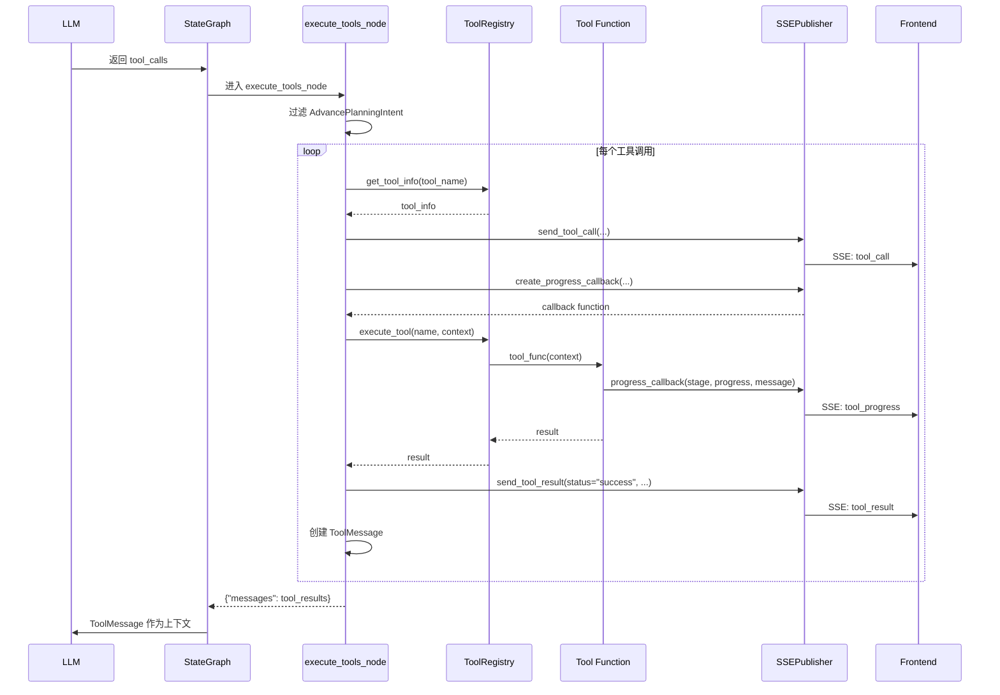
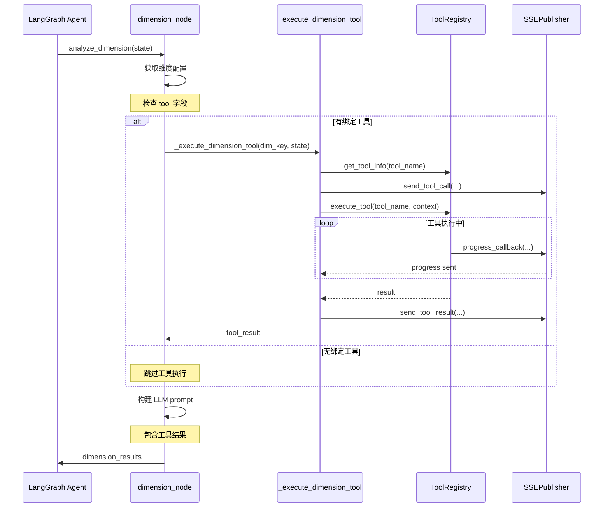

# 工具系统实现

本文档详细说明 Tool 注册机制、工具实现和 Tool-Dimension 绑定。

## 目录

- [Tool注册机制](#tool注册机制)
- [内置工具实现](#内置工具实现)
- [Tool-Dimension绑定](#tool-dimension绑定)
- [工具执行流程](#工具执行流程)
- [执行序列图](#执行序列图)

---

## Tool注册机制

### ToolRegistry 类设计

ToolRegistry 是工具注册和管理的核心:

```python
# src/tools/registry.py
class ToolRegistry:
    """
    简化的工具注册中心

    使用装饰器注册工具函数，支持 LangChain 原生 @tool 装饰器。
    """

    _tools: Dict[str, Callable] = {}
    _tool_metadata: Dict[str, ToolMetadata] = {}

    @classmethod
    def register(cls, name: str):
        """
        装饰器：注册工具函数

        Usage:
            @ToolRegistry.register("my_tool")
            def my_tool(context: dict) -> str:
                ...
        """
        def decorator(func: Callable) -> Callable:
            cls._tools[name] = func
            logger.info(f"[ToolRegistry] 工具已注册: {name}")
            return func
        return decorator

    @classmethod
    def get_tool(cls, name: str) -> Optional[Callable]:
        """获取工具函数"""
        return cls._tools.get(name)

    @classmethod
    def execute_tool(cls, name: str, context: Dict[str, Any]) -> str:
        """
        执行工具并返回结果

        Args:
            name: 工具名称
            context: 上下文数据

        Returns:
            工具输出字符串
        """
        tool_func = cls.get_tool(name)
        if not tool_func:
            raise ValueError(f"工具不存在: {name}")

        try:
            result = tool_func(context)
            logger.info(f"[ToolRegistry] 工具执行成功: {name}")
            return result
        except Exception as e:
            logger.error(f"[ToolRegistry] 工具执行失败: {name}, 错误: {e}")
            raise
```

### ToolMetadata 元数据

```python
@dataclass
class ToolMetadata:
    """工具元数据（用于 LLM bind_tools）"""

    name: str
    description: str
    input_schema: Optional[Type[BaseModel]] = None
    display_name: Optional[str] = None
    parameters: Optional[Dict[str, Any]] = None
    display_hints: Optional[Dict[str, Any]] = None

    def __post_init__(self):
        if self.display_name is None:
            self.display_name = self.name
        if self.display_hints is None:
            self.display_hints = {"primary_view": "text", "priority_fields": []}

    def to_openai_tool_schema(self) -> Dict[str, Any]:
        """转换为 OpenAI function calling 格式"""
        schema = {
            "type": "function",
            "function": {
                "name": self.name,
                "description": self.description,
            }
        }

        if self.parameters:
            schema["function"]["parameters"] = self.parameters
        elif self.input_schema:
            schema["function"]["parameters"] = self.input_schema.model_json_schema()

        return schema
```

### 工具参数 Schema

```python
# src/tools/registry.py
TOOL_PARAMETER_SCHEMAS = {
    "gis_analysis": {
        "type": "object",
        "properties": {
            "analysis_type": {
                "type": "string",
                "enum": ["land_use_analysis", "soil_analysis", "hydrology_analysis"],
                "description": "分析类型"
            },
            "geo_data_path": {"type": "string", "description": "数据文件路径"},
        },
        "required": ["analysis_type"]
    },
    "accessibility_analysis": {
        "type": "object",
        "properties": {
            "analysis_type": {
                "type": "string",
                "enum": ["driving_accessibility", "walking_accessibility", "service_coverage"],
                "description": "分析类型"
            },
            "origin": {"type": "array", "items": {"type": "number"}, "description": "起点坐标"},
            "center": {"type": "array", "items": {"type": "number"}, "description": "中心坐标"},
        },
        "required": ["analysis_type"]
    },
    "knowledge_search": {
        "type": "object",
        "properties": {
            "query": {"type": "string", "description": "搜索查询"},
            "top_k": {"type": "integer", "default": 5, "description": "返回结果数量"},
        },
        "required": ["query"]
    },
    "web_search": {
        "type": "object",
        "properties": {
            "query": {"type": "string", "description": "搜索查询"},
            "backend": {"type": "string", "default": "tavily", "description": "搜索后端"},
        },
        "required": ["query"]
    },
}
```

### 工具元数据定义

```python
TOOL_METADATA_DEFINITIONS: Dict[str, Dict[str, Any]] = {
    "gis_analysis": {
        "display_name": "GIS 空间分析",
        "description": "执行空间分析，如土地利用分析、土壤分析、水文分析等。",
        "estimated_time": 8.0,
        "display_hints": {"primary_view": "map", "priority_fields": ["total_area", "land_use_types"]}
    },
    "population_prediction": {
        "display_name": "人口预测",
        "description": "基于人口模型预测未来人口变化趋势，支持村庄规划标准模型。",
        "estimated_time": 3.0,
        "display_hints": {"primary_view": "chart", "priority_fields": ["forecast_population", "growth_rate"]}
    },
    "accessibility_analysis": {
        "display_name": "可达性分析",
        "description": "分析设施可达性，计算服务覆盖范围和出行时间。",
        "estimated_time": 6.0,
        "display_hints": {"primary_view": "table", "priority_fields": ["coverage_rate", "accessibility_matrix"]}
    },
    "knowledge_search": {
        "display_name": "知识检索",
        "description": "从知识库检索专业数据和法规条文。",
        "estimated_time": 2.0,
        "display_hints": {"primary_view": "text", "priority_fields": ["content", "source"]}
    },
    "web_search": {
        "display_name": "网络搜索",
        "description": "从互联网搜索实时信息。",
        "estimated_time": 4.0,
        "display_hints": {"primary_view": "text", "priority_fields": ["results"]}
    },
}
```

---

## 内置工具实现

### 知识检索工具 (knowledge_search)

```python
# src/tools/builtin/__init__.py
def knowledge_search_tool(context: Dict[str, Any]) -> str:
    """
    RAG 知识检索工具

    从知识库中检索相关信息，支持专业数据和法规条文的查询。

    Args:
        context: 包含 query 和可选参数的上下文字典
            - query: 查询字符串（必需）
            - top_k: 返回结果数量（可选，默认 5）
            - context_mode: 上下文模式（可选，默认 "standard"）

    Returns:
        格式化的知识检索结果
    """
    try:
        from ...rag.core.tools import knowledge_search_tool as rag_search_tool

        query = context.get("query", "")
        top_k = context.get("top_k", 5)
        context_mode = context.get("context_mode", "standard")

        if not query:
            return "## 知识检索错误\n\n错误: 缺少查询参数 'query'"

        result = rag_search_tool.invoke({
            "query": query,
            "top_k": top_k,
            "context_mode": context_mode
        })

        logger.info(f"[ToolRegistry] 知识检索成功: query='{query[:50]}...'")
        return result

    except Exception as e:
        logger.error(f"[ToolRegistry] 知识检索失败: {e}")
        return f"## 知识检索错误\n\n错误: {str(e)}"
```

### 网络搜索工具 (web_search)

```python
# src/tools/builtin/__init__.py
def web_search_tool(context: Dict[str, Any]) -> str:
    """
    网络搜索工具

    从互联网搜索实时信息，支持新闻、政策、技术数据等查询。

    Args:
        context: 包含查询参数的上下文字典
            - query: 搜索查询字符串（必需）
            - backend: 搜索后端（可选，默认"tavily"）
            - num_results: 返回结果数量（可选，默认 5）

    Returns:
        格式化的网络搜索结果
    """
    try:
        from ..search_tool import get_search_backend, format_search_results

        query = context.get("query", "")
        backend = context.get("backend", "tavily")
        num_results = context.get("num_results", 5)

        if not query:
            return "## 网络搜索错误\n\n错误：缺少查询参数 'query'"

        logger.info(f"[web_search] 执行搜索：query='{query[:50]}...', backend={backend}")

        search_backend = get_search_backend(backend)
        results = search_backend.search(query, num_results=num_results)

        return format_search_results(results, max_results=num_results)

    except ImportError as e:
        return f"## 网络搜索错误\n\n错误：搜索模块未正确安装 - {str(e)}"
    except ValueError as e:
        return f"## 网络搜索错误\n\n错误：{str(e)}"
    except Exception as e:
        return f"## 网络搜索错误\n\n错误：{str(e)}"
```

### 人口预测工具 (population_model_v1)

```python
# src/tools/builtin/population.py
def calculate_population(context: Dict[str, Any]) -> str:
    """
    人口预测工具

    基于村庄规划标准模型预测未来人口变化。

    Args:
        context: 包含预测参数的上下文
            - baseline_population: 基期人口数
            - baseline_year: 基期年份
            - target_year: 目标年份（可选）

    Returns:
        人口预测结果，包括预测人口、增长率等
    """
    baseline_population = context.get("baseline_population")
    baseline_year = context.get("baseline_year")

    if not baseline_population or not baseline_year:
        return "## 人口预测错误\n\n错误：缺少基期人口或基期年份参数"

    # 执行预测计算
    # ... 预测逻辑

    return f"""## 人口预测结果

### 基础数据
- 基期年份: {baseline_year}
- 基期人口: {baseline_population} 人

### 预测结果
- 预测人口: {predicted_population} 人
- 年均增长率: {growth_rate}%
- 人口变化: +{population_change} 人
"""
```

### 内置工具列表

# 核心注册工具（@ToolRegistry.register）
| 工具名称 | 显示名称 | 注册位置 |
|----------|----------|----------|
| population_prediction | 人口预测 | src/tools/builtin/population.py |
| knowledge_search | 知识检索 | src/rag/core/tools.py |
| web_search | 网络搜索 | src/tools/search_tool.py |

# 维度绑定工具（dimension_metadata.py tool 字段）
| 维度 | 绑定工具 |
|------|----------|
| socio_economic | population_prediction |
| natural_environment | wfs_data_fetch |
| traffic | accessibility_analysis |
| public_services | poi_search |
| spatial_structure | planning_vectorizer |
| traffic_planning | isochrone_analysis |
| ecological | ecological_sensitivity |

### GIS 工具详解

#### gis_data_fetch - WFS 数据获取

```python
# 获取天地图 WFS 数据
result = ToolRegistry.execute_tool("gis_data_fetch", {
    "location": "平远县泗水镇金田村",
    "buffer_km": 5.0,
    "max_features": 500
})

# 返回结构
{
    "success": True,
    "location": "平远县泗水镇金田村",
    "center": [116.04, 24.82],
    "water": True,      # 水系数据是否成功
    "road": True,       # 道路数据是否成功
    "residential": False,
    "data": {
        "water": {"success": True, "geojson": {...}},
        "road": {"success": True, "geojson": {...}},
        "residential": {"success": False, "geojson": null}
    }
}
```

#### poi_search - POI 搜索

```python
# 区域 POI 搜索（高德优先）
result = ToolRegistry.execute_tool("poi_search", {
    "keyword": "学校",
    "region": "平远县",
    "page_size": 20
})

# 返回结构
{
    "success": True,
    "pois": [
        {
            "id": "B0FFAB1234",
            "name": "某某学校",
            "lon": 115.892285,       # WGS-84（已转换）
            "lat": 24.559714,
            "lon_gcj02": 115.893000, # 原始 GCJ-02
            "lat_gcj02": 24.560000,
            "address": "广东省梅州市平远县",
            "category": "科教文化服务;学校"
        }
    ],
    "total_count": 5,
    "source": "amap",  # 数据来源
    "geojson": {...}   # GeoJSON 格式
}
```

---

## GIS 工具架构

GIS 工具位于 `src/tools/core/` 目录：

```
src/tools/
├── core/
│   ├── gis_core.py           # 核心分析函数
│   ├── gis_tool_wrappers.py  # 工具包装器
│   └── gis_data_fetcher.py   # WFS 数据获取
├── geocoding/
│   ├── amap/provider.py      # 高德API（含GCJ-02→WGS-84转换）
│   ├── tianditu/provider.py  # 天地图WFS
│   └── poi_provider.py       # POI 搜索
```

### 坐标转换

高德API使用GCJ-02坐标系，天地图使用WGS-84。
`gcj02_to_wgs84()` 函数在 `src/tools/geocoding/amap/provider.py:76-101` 实现坐标转换。

---

## Tool-Dimension绑定

### 维度元数据中的 tool 字段

维度通过 `tool` 字段绑定工具:

```python
# src/config/dimension_metadata.py
DIMENSIONS_METADATA = {
    "socio_economic": {
        "key": "socio_economic",
        "name": "社会经济分析",
        "layer": 1,
        "tool": "population_model_v1",  # 绑定人口预测工具
        # ...
    },
    "traffic": {
        "key": "traffic",
        "name": "道路交通分析",
        "layer": 1,
        "tool": "accessibility_analysis",  # 绑定可达性分析工具
        # ...
    },
    "natural_environment": {
        "key": "natural_environment",
        "name": "自然环境分析",
        "layer": 1,
        "tool": "wfs_data_fetch",  # 绑定 WFS 数据获取工具
        # ...
    },
}
```

### 工具执行上下文构建

维度分析时构建工具执行上下文:

```python
# src/orchestration/nodes/dimension_node.py
async def _execute_dimension_tool(
    dimension_key: str,
    state: Dict[str, Any]
) -> Optional[str]:
    """
    执行维度绑定的工具

    Args:
        dimension_key: 维度键名
        state: 当前状态

    Returns:
        工具执行结果，如果无工具则返回 None
    """
    config = get_dimension_config(dimension_key)
    tool_name = config.get("tool")

    if not tool_name:
        return None

    session_id = state.get("session_id", "")
    project_name = state.get("project_name", "")

    # 获取工具信息
    tool_info = ToolRegistry.get_tool_info(tool_name)

    # 发送 tool_call 事件
    SSEPublisher.send_tool_call(
        session_id=session_id,
        tool_name=tool_name,
        tool_display_name=tool_info["display_name"],
        description=tool_info["description"],
        estimated_time=tool_info["estimated_time"]
    )

    try:
        # 创建进度回调
        progress_callback = SSEPublisher.create_progress_callback(
            session_id=session_id,
            tool_name=tool_name
        )

        # 构建执行上下文
        context = {
            "session_id": session_id,
            "project_name": project_name,
            "progress_callback": progress_callback,
            # 维度特定参数...
        }

        result = ToolRegistry.execute_tool(tool_name, context)

        # 发送 tool_result 成功事件
        SSEPublisher.send_tool_result(
            session_id=session_id,
            tool_name=tool_name,
            status="success",
            result_preview=result[:200] if result else None
        )

        return result

    except Exception as e:
        # 发送 tool_result 错误事件
        SSEPublisher.send_tool_result(
            session_id=session_id,
            tool_name=tool_name,
            status="error",
            error=str(e)
        )
        return None
```

### 进度回调机制

工具执行时通过进度回调发送 SSE 事件:

```python
# src/utils/sse_publisher.py
@staticmethod
def create_progress_callback(session_id: str, tool_name: str) -> Callable[[str, float, str], None]:
    """
    创建工具进度回调函数

    Args:
        session_id: 会话 ID
        tool_name: 工具名称

    Returns:
        回调函数，接受 (stage, progress, message) 参数
    """
    def on_progress(stage: str, progress: float, message: str) -> None:
        SSEPublisher.send_tool_progress(
            session_id=session_id,
            tool_name=tool_name,
            stage=stage,
            progress=progress,
            message=message
        )
    return on_progress
```

---

## 工具执行流程

### execute_tools_node 入口处理

当 LLM 返回工具调用时，由 `execute_tools_node` 处理:

```python
# src/orchestration/main_graph.py
async def execute_tools_node(state: UnifiedPlanningState) -> Dict[str, Any]:
    """
    工具执行节点

    执行 LLM 返回的工具调用，发送完整的工具事件流：
    tool_call -> tool_progress -> tool_result
    """
    messages = state.get("messages", [])
    session_id = state.get("session_id", "")

    last_message = messages[-1] if messages else None
    if not last_message or not hasattr(last_message, "tool_calls"):
        return {"messages": []}

    tool_calls = getattr(last_message, "tool_calls", [])
    if not tool_calls:
        return {"messages": []}

    # 过滤掉 AdvancePlanningIntent（已由 intent_router 处理）
    regular_tool_calls = [tc for tc in tool_calls if tc.get("name") != "AdvancePlanningIntent"]

    if not regular_tool_calls:
        return {"messages": []}

    tool_results = []

    for tool_call in regular_tool_calls:
        tool_name = tool_call.get("name", "")
        tool_args = tool_call.get("args", {})

        logger.info(f"[工具执行] 执行工具: {tool_name}")

        # 单次查找获取所有工具元数据
        tool_info = ToolRegistry.get_tool_info(tool_name)

        # 发送 tool_call 事件
        SSEPublisher.send_tool_call(
            session_id=session_id,
            tool_name=tool_name,
            tool_display_name=tool_info["display_name"],
            description=tool_info["description"],
            estimated_time=tool_info["estimated_time"]
        )

        try:
            # 使用工厂方法创建进度回调
            progress_callback = SSEPublisher.create_progress_callback(
                session_id=session_id,
                tool_name=tool_name
            )

            context = {
                **tool_args,
                "session_id": session_id,
                "project_name": state.get("project_name", ""),
                "progress_callback": progress_callback
            }
            result = ToolRegistry.execute_tool(tool_name, context)

            tool_results.append(
                ToolMessage(
                    content=str(result),
                    tool_call_id=tool_call.get("id", "")
                )
            )

            # 发送 tool_result 成功事件
            SSEPublisher.send_tool_result(
                session_id=session_id,
                tool_name=tool_name,
                status="success",
                result_preview=str(result)[:200]
            )

        except Exception as e:
            error_msg = f"工具执行失败: {str(e)}"
            logger.error(f"[工具执行] {tool_name} 失败: {e}")

            tool_results.append(
                ToolMessage(
                    content=error_msg,
                    tool_call_id=tool_call.get("id", "")
                )
            )

            # 发送 tool_result 错误事件
            SSEPublisher.send_tool_result(
                session_id=session_id,
                tool_name=tool_name,
                status="error",
                error=str(e)
            )

    return {"messages": tool_results}
```

### SSE 事件流

工具执行产生三种 SSE 事件:

1. **tool_call** - 工具开始执行
2. **tool_progress** - 执行进度更新
3. **tool_result** - 执行完成（成功或失败）

```python
# SSE 事件示例

# tool_call
{
    "type": "tool_call",
    "tool_name": "accessibility_analysis",
    "tool_display_name": "可达性分析",
    "description": "分析设施可达性，计算服务覆盖范围",
    "estimated_time": 6.0,
    "timestamp": "2024-01-15T10:30:00"
}

# tool_progress
{
    "type": "tool_progress",
    "tool_name": "accessibility_analysis",
    "stage": "processing",
    "progress": 0.5,
    "message": "正在计算服务覆盖范围...",
    "timestamp": "2024-01-15T10:30:03"
}

# tool_result
{
    "type": "tool_result",
    "tool_name": "accessibility_analysis",
    "status": "success",
    "result_preview": "服务覆盖率: 85%\n平均出行时间: 15分钟...",
    "timestamp": "2024-01-15T10:30:06"
}
```

---

## 执行序列图

### 工具执行完整流程



### 维度工具绑定执行



---

## 关键代码路径

| 功能 | 文件路径 | 关键类/函数 |
|------|----------|-------------|
| 工具注册 | `src/tools/registry.py` | `ToolRegistry.register` |
| 工具执行 | `src/tools/registry.py` | `ToolRegistry.execute_tool` |
| 元数据定义 | `src/tools/registry.py` | `ToolMetadata`, `TOOL_METADATA_DEFINITIONS` |
| 参数 Schema | `src/tools/registry.py` | `TOOL_PARAMETER_SCHEMAS` |
| 内置工具 | `src/tools/builtin/__init__.py` | `knowledge_search_tool`, `web_search_tool` |
| 人口预测 | `src/tools/builtin/population.py` | `calculate_population` |
| GIS 工具包装 | `src/tools/core/gis_tool_wrappers.py` | `wrap_gis_data_fetch`, `wrap_poi_search` |
| WFS 数据获取 | `src/tools/core/gis_data_fetcher.py` | `GISDataFetcher` |
| POI 搜索 | `src/tools/geocoding/poi_provider.py` | `POIProvider` |
| 坐标转换 | `src/tools/geocoding/amap/provider.py` | `gcj02_to_wgs84` |
| SSE 发布 | `src/utils/sse_publisher.py` | `send_tool_*` 系列方法 |
| 工具节点 | `src/orchestration/main_graph.py` | `execute_tools_node` |

---

## 完整GIS工具列表

### 空间分析工具

| 工具名称 | 功能描述 | 文件路径 |
|----------|----------|----------|
| spatial_overlay | 空间叠加分析（intersect, union, difference, clip） | src/tools/core/spatial_analysis.py |
| spatial_query | 空间查询（contains, intersects, within, nearest） | src/tools/core/spatial_analysis.py |
| geojson_to_geodataframe | GeoJSON 转 GeoDataFrame | src/tools/core/spatial_analysis.py |

### GIS数据获取工具

| 工具名称 | 功能描述 | 文件路径 |
|----------|----------|----------|
| wfs_data_fetch | 天地图WFS数据获取（水系、道路、居民地） | src/tools/core/gis_data_fetcher.py |
| poi_search | POI搜索（高德优先策略） | src/tools/geocoding/poi_provider.py |
| gis_coverage_calculator | GIS覆盖率计算 | src/tools/core/gis_core.py |

### 规划分析工具

| 工具名称 | 功能描述 | 维度绑定 |
|----------|----------|----------|
| isochrone_analysis | 等时圈分析（步行/驾车可达范围） | traffic_planning |
| planning_vectorizer | 规划矢量化（生成GeoJSON图层） | spatial_structure |
| facility_validator | 设施选址验证（服务半径、容量评估） | public_service |
| ecological_sensitivity | 生态敏感性分析 | ecological |
| accessibility_analysis | 可达性分析（服务覆盖范围） | traffic |

### 其他工具

| 工具名称 | 功能描述 |
|----------|----------|
| population_model_v1 | 人口预测（村庄规划标准模型） |
| knowledge_search | RAG知识检索 |
| web_search | 网络搜索（Tavily后端） |

---

## 结果规范化层

### NormalizedToolResult

统一的工具结果格式，确保前端展示一致性：

```python
# src/tools/types.py
from dataclasses import dataclass
from enum import Enum

class ResultDataType(Enum):
    """结果数据类型枚举"""
    GEOJSON = "geojson"       # GIS数据（地图展示）
    ANALYSIS = "analysis"     # 分析结果（图表/表格）
    TEXT = "text"             # 纯文本内容
    ERROR = "error"           # 错误信息

@dataclass
class NormalizedToolResult:
    """规范化工具结果"""
    success: bool
    data_type: ResultDataType
    data: Dict[str, Any]          # 实际数据内容
    summary: str                  # 结果摘要
    metadata: Dict[str, Any]      # 元数据（耗时、来源等）
    error: Optional[str] = None   # 错误信息

    def to_frontend_format(self) -> Dict[str, Any]:
        """转换为前端展示格式"""
        if self.data_type == ResultDataType.GEOJSON:
            return {
                "gisData": {
                    "layers": self.data.get("layers", []),
                    "mapOptions": self.data.get("mapOptions"),
                    "analysisData": self.data.get("analysisData")
                }
            }
        elif self.data_type == ResultDataType.ANALYSIS:
            return {
                "analysisData": self.data,
                "summary": self.summary
            }
        else:
            return {"content": self.summary}
```

### normalize_tool_result函数

```python
def normalize_tool_result(
    raw_result: Any,
    tool_name: str
) -> NormalizedToolResult:
    """
    将原始工具结果规范化

    自动识别数据类型：
    - 包含 geojson/layers → GEOJSON
    - 包含 analysisData/scores → ANALYSIS
    - 其他 → TEXT
    """
    if isinstance(raw_result, dict):
        if "geojson" in raw_result or "layers" in raw_result:
            return NormalizedToolResult(
                success=True,
                data_type=ResultDataType.GEOJSON,
                data=raw_result,
                summary=raw_result.get("summary", "GIS分析完成")
            )
        elif "analysisData" in raw_result or "scores" in raw_result:
            return NormalizedToolResult(
                success=True,
                data_type=ResultDataType.ANALYSIS,
                data=raw_result,
                summary=raw_result.get("summary", "分析完成")
            )

    # 文本结果
    return NormalizedToolResult(
        success=True,
        data_type=ResultDataType.TEXT,
        data={},
        summary=str(raw_result)[:500]
    )
```

---

## POI Provider高德优先策略

### 架构设计

POI搜索采用高德优先策略，失败时回退天地图：

```
src/tools/geocoding/
├── amap/provider.py      # 高德API（30 QPS，数据丰富）
│   ├── gcj02_to_wgs84()  # 坐标转换
│   └── search_poi_*()    # POI搜索方法
├── tianditu/provider.py  # 天地图WFS（回退）
└── poi_provider.py       # 统一接口（高德优先）
```

### 高德优先策略

```python
# src/tools/geocoding/poi_provider.py
class POIProvider:
    """POI服务统一接口 - 高德优先策略"""

    @classmethod
    def search_poi_nearby(cls, keyword, center, radius, page_size):
        """周边POI搜索（高德优先）"""
        # 1. 优先高德（30 QPS，POI数据丰富）
        amap = cls.get_amap_provider()
        result = amap.search_poi_nearby(keyword, center, radius, page_size)

        if result.success:
            return {
                "pois": result.data.get("pois", []),
                "geojson": cls._build_geojson(result.data.get("pois", [])),
                "source": "amap",  # 标记来源
                # 高德坐标已转换为WGS-84
            }

        # 2. 回退天地图
        logger.warning(f"[POIProvider] 高德搜索失败，回退天地图")
        tianditu = cls.get_tianditu_provider()
        result = tianditu.search_poi(keyword, center, radius, page_size)

        if result.success:
            return {
                "pois": result.data.get("pois", []),
                "geojson": result.data.get("geojson"),
                "source": "tianditu",
            }

        return {"success": False, "error": "POI搜索失败"}

    @classmethod
    def search_public_services(cls, center, radius, categories):
        """按类型码搜索公共服务设施（高德专用功能）"""
        # 使用高德POI类型码批量搜索
        # POI_TYPES_PUBLIC_SERVICE = {"幼儿园": "141100", "小学": "141200", ...}
        pass
```

### 数据来源标记

返回结果包含 `source` 字段标记数据来源：

```python
{
    "success": True,
    "pois": [...],
    "geojson": {...},
    "source": "amap",  # 或 "tianditu"
    "center": (116.04, 24.82),
    "radius": 1000
}
```

---

## ParamSource枚举

工具参数来源类型，定义参数值的获取方式：

```python
# src/orchestration/nodes/dimension_node.py
class ParamSource(str, Enum):
    """工具参数来源枚举"""
    LITERAL = "literal"       # 固定值（硬编码）
    GIS_CACHE = "gis_cache"   # 从GIS分析结果缓存取值
    CONFIG = "config"         # 从state.config取值
    CONTEXT = "context"       # 从context直接取值
```

### tool_params配置示例

```python
# src/config/dimension_metadata.py
"traffic": {
    "tool": "accessibility_analysis",
    "tool_params": {
        "analysis_type": {
            "source": "literal",
            "value": "service_coverage"
        },
        "center": {
            "source": "gis_cache",
            "path": "_auto_fetched.center"
        }
    }
}

"public_services": {
    "tool": "poi_search",
    "tool_params": {
        "keyword": {
            "source": "literal",
            "value": "学校|医院|超市|银行"
        },
        "center": {
            "source": "gis_cache",
            "path": "_auto_fetched.center"
        },
        "radius": {
            "source": "literal",
            "value": 1500
        }
    }
}
```

---

## 工具与Agent协作补充

### 意图路由逻辑

当LLM返回工具调用时，`intent_router` 进行分流：

```python
# src/orchestration/routing.py
def intent_router(state: Dict[str, Any]) -> str:
    """
    意图路由

    Returns:
        "execute_tools"  - 执行常规工具调用
        "route_planning" - 推进规划流程（AdvancePlanningIntent）
        END              - 普通对话
    """
    last_msg = state.get("messages", [])[-1]

    if hasattr(last_msg, "tool_calls") and last_msg.tool_calls:
        for tc in last_msg.tool_calls:
            if tc["name"] == "AdvancePlanningIntent":
                return "route_planning"  # 特殊处理
        return "execute_tools"  # 常规工具

    return END  # 普通对话
```

### 维度工具参数来源

维度分析时，工具参数从 `tool_params` 配置解析：

```python
# src/orchestration/nodes/dimension_node.py
def resolve_tool_params(tool_params_config: Dict, state: Dict) -> Dict:
    """
    解析工具参数配置

    根据 ParamSource 确定参数值：
    - LITERAL: 直接使用配置中的 value
    - GIS_CACHE: 从 gis_cache 按路径取值
    - CONFIG: 从 state.config 取值
    - CONTEXT: 从 context 直接取值
    """
    params = {}
    for param_name, param_config in tool_params_config.items():
        source = param_config.get("source")
        if source == "literal":
            params[param_name] = param_config.get("value")
        elif source == "gis_cache":
            gis_cache = state.get("gis_cache", {})
            path = param_config.get("path")
            params[param_name] = gis_cache.get(path)
        elif source == "config":
            config = state.get("config", {})
            path = param_config.get("path")
            params[param_name] = config.get(path)
        elif source == "context":
            params[param_name] = state.get(param_config.get("key"))
    return params
```

---

## 关键文件路径汇总

| 类别 | 文件路径 |
|------|----------|
| 注册中心 | src/tools/registry.py |
| 类型定义 | src/tools/types.py |
| GIS核心 | src/tools/core/gis_core.py |
| 空间分析 | src/tools/core/spatial_analysis.py |
| 数据获取 | src/tools/core/gis_data_fetcher.py |
| 工具包装 | src/tools/core/gis_tool_wrappers.py |
| 等时圈 | src/tools/core/isochrone_analysis.py |
| 高德API | src/tools/geocoding/amap/provider.py |
| 天地图API | src/tools/geocoding/tianditu/provider.py |
| POI接口 | src/tools/geocoding/poi_provider.py |
| 内置工具 | src/tools/builtin/__init__.py |
| 人口预测 | src/tools/builtin/population.py |
| 维度节点 | src/orchestration/nodes/dimension_node.py |

---

## 相关文档

- [Agent核心实现](./agent-core-implementation.md) - Router Agent 架构
- [维度与层级数据流](./layer-dimension-dataflow.md) - Tool-Dimension 绑定
- [后端API与数据流](./backend-api-dataflow.md) - SSE 事件类型
- [GIS系统架构](./gis-system-architecture.md) - GIS 数据获取与可视化