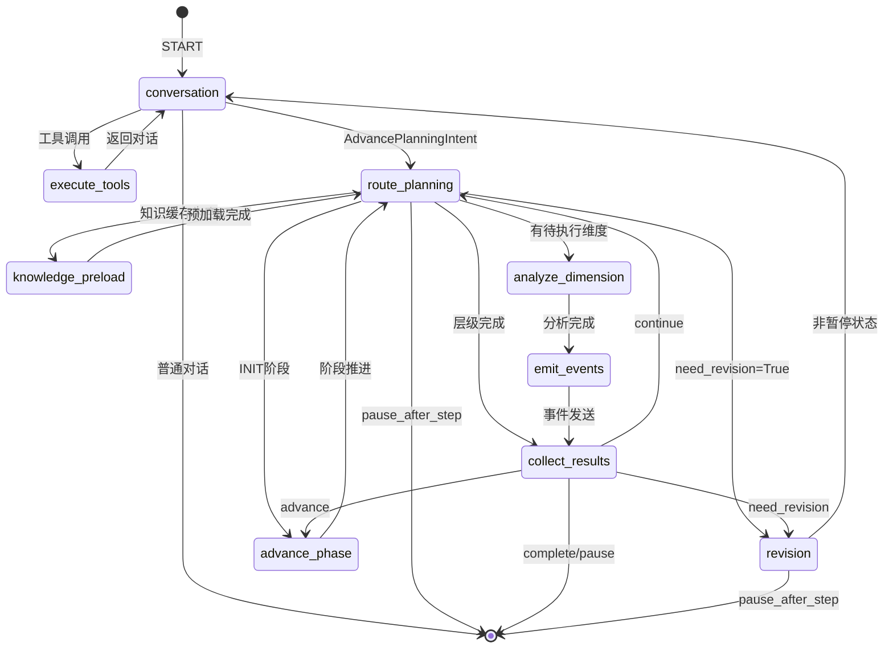
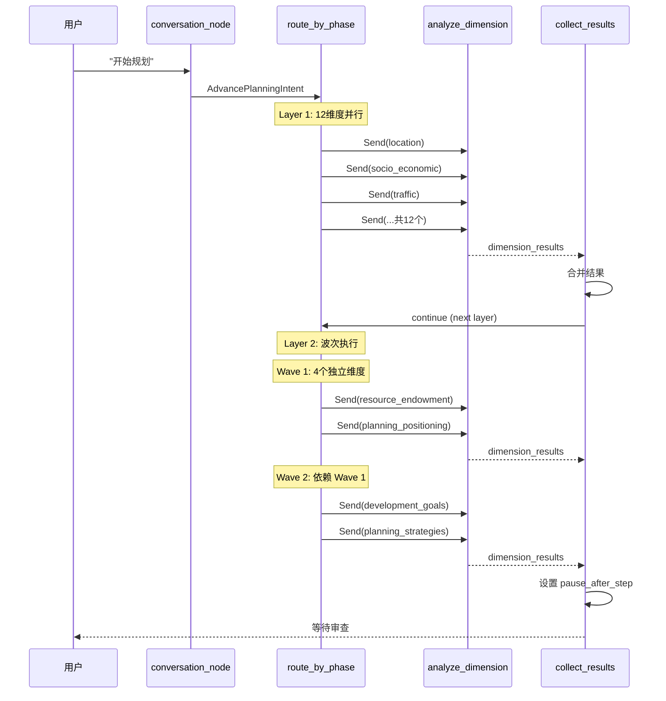

# Agent核心实现

本文档详细说明 Router Agent 架构、StateGraph 设计和执行流程。

## 目录

- [Router Agent架构](#router-agent架构)
- [StateGraph设计](#stategraph设计)
- [统一状态定义](#统一状态定义)
- [执行流程](#执行流程)
- [状态机图](#状态机图)

---

## Router Agent架构

### 概述

Router Agent 采用中央路由模式，使用单一 StateGraph 和单一状态定义:

```
[用户输入]
    │
    ▼
conversation_node (LLM: bind_tools)
    │ intent_router
    ├─► [闲聊/问答] END
    ├─► [工具调用] execute_tools
    └─► [推进规划] route_by_phase
                          │
                   [Send N 维度]
                          │
                          ▼
                  analyze_dimension
                          │
                   emit_sse_events
                          │
                          ▼
                  collect_results
                          │
                          ▼
                  check_completion
                          │
               ┌──────────┴──────────┐
               ▼                      ▼
         advance_phase           conversation
               │                      │
               └──────────────────────┘
```

### 中央路由节点

`conversation_node` 是 Router Agent 的核心，负责:

1. 接收用户输入
2. 调用 LLM 进行意图识别
3. 根据工具调用决定下一步

```python
# src/orchestration/main_graph.py
async def conversation_node(state: UnifiedPlanningState) -> Dict[str, Any]:
    """
    中央路由节点（大脑）

    使用 LLM bind_tools 实现意图识别:
    - 普通对话：直接回复
    - 工具调用：返回 tool_calls
    - 推进规划：返回 AdvancePlanningIntent
    """
    messages = list(state.get("messages", []))
    phase = state.get("phase", PlanningPhase.INIT.value)
    project_name = state.get("project_name", "")
    config = state.get("config", {})
    reports = state.get("reports", {})
    previous_layer = state.get("previous_layer", 0)

    # 构建系统提示
    system_prompt = _build_system_prompt(
        phase, project_name, config, reports,
        previous_layer=previous_layer
    )

    # 获取 LLM 并绑定工具
    llm = create_llm(model=LLM_MODEL, temperature=0.7, max_tokens=MAX_TOKENS)
    llm_with_tools = llm.bind_tools([ADVANCE_PLANNING_TOOL])

    # 构建消息
    full_messages = [SystemMessage(content=system_prompt)] + messages

    # 调用 LLM
    response = await llm_with_tools.ainvoke(full_messages)

    logger.info(f"[对话节点] LLM 响应: tool_calls={getattr(response, 'tool_calls', None)}")

    return {"messages": [response]}
```

### 意图识别机制

`intent_router` 根据最后一条消息决定下一步:

```python
# src/orchestration/routing.py
def intent_router(state: Dict[str, Any]) -> str:
    """
    意图路由 - 根据最后一条消息决定下一步

    Returns:
        "execute_tools": 执行工具调用
        "route_planning": 推进规划流程
        END: 普通对话，结束本轮
    """
    messages = state.get("messages", [])
    if not messages:
        return END

    last_msg = messages[-1]

    # 检查是否有工具调用
    if hasattr(last_msg, "tool_calls") and last_msg.tool_calls:
        for tool_call in last_msg.tool_calls:
            tool_name = tool_call.get("name", "")
            if tool_name == "AdvancePlanningIntent":
                logger.info("[意图路由] 检测到 AdvancePlanningIntent，推进规划")
                return "route_planning"
        # 其他工具调用
        return "execute_tools"

    # 检查是否需要修订
    if state.get("need_revision"):
        logger.info("[意图路由] 检测到 need_revision，进入修订流程")
        return "route_planning"

    # 普通对话，结束本轮
    return END
```

---

## StateGraph设计

### 节点定义

```python
# src/orchestration/main_graph.py
def create_unified_planning_graph(checkpointer=None) -> StateGraph:
    builder = StateGraph(UnifiedPlanningState)

    # 添加节点
    builder.add_node("conversation", conversation_node)
    builder.add_node("execute_tools", execute_tools_node)
    builder.add_node("knowledge_preload", knowledge_preload_node)
    builder.add_node("analyze_dimension", analyze_dimension)
    builder.add_node("emit_events", emit_events)
    builder.add_node("collect_results", collect_results)
    builder.add_node("advance_phase", advance_phase)
    builder.add_node("revision", revision_node)

    # 路由节点（为 AdvancePlanningIntent 添加 ToolMessage）
    def route_planning_node(state: UnifiedPlanningState) -> Dict[str, Any]:
        messages = state.get("messages", [])
        last_msg = messages[-1] if messages else None

        if last_msg and hasattr(last_msg, "tool_calls") and last_msg.tool_calls:
            for tool_call in last_msg.tool_calls:
                if tool_call.get("name") == "AdvancePlanningIntent":
                    return {
                        "messages": [
                            ToolMessage(
                                content="规划流程已启动，开始分析维度...",
                                tool_call_id=tool_call.get("id", "")
                            )
                        ]
                    }
        return {}

    builder.add_node("route_planning", route_planning_node)

    # ... 添加边
```

**注意**：emit_events 节点负责从 `sse_events` 字段批量发送维度分析产生的事件。层级完成事件（layer_completed、pause）由 `collect_layer_results` 函数直接发送。

### 条件边路由

```python
# 入口：对话节点
builder.add_edge(START, "conversation")

# 意图路由
builder.add_conditional_edges(
    "conversation",
    route_intent,
    {
        "execute_tools": "execute_tools",
        "route_planning": "route_planning",
        END: END
    }
)

# 工具执行后返回对话
builder.add_edge("execute_tools", "conversation")

# 规划路由（Send API 动态分发）
builder.add_conditional_edges(
    "route_planning",
    route_planning,
    {
        "knowledge_preload": "knowledge_preload",
        "analyze_dimension": "analyze_dimension",
        "revision": "revision",
        "collect_results": "collect_results",
        "advance_phase": "advance_phase",
        END: END
    }
)

# 知识预加载完成后，返回路由重新分发
builder.add_edge("knowledge_preload", "route_planning")

# 维度分析 -> 发送事件 -> 收集结果
builder.add_edge("analyze_dimension", "emit_events")
builder.add_edge("emit_events", "collect_results")

# 收集结果 -> 检查完成
builder.add_conditional_edges(
    "collect_results",
    check_completion,
    {
        "continue": "route_planning",  # 波次/维度推进后自动继续执行
        "advance": "advance_phase",    # 推进到下一阶段
        "complete": END,               # 规划完成
        "revision": "revision",        # 进入修订
        "pause": END                   # 暂停等待审查
    }
)

# 阶段推进 -> 路由分发
builder.add_edge("advance_phase", "route_planning")

# 修订 -> 条件路由
builder.add_conditional_edges(
    "revision",
    route_revision,
    {
        END: END,
        "conversation": "conversation"
    }
)
```

### Send API 并行分发

使用 LangGraph 的 Send API 实现维度并行执行:

```python
# src/orchestration/routing.py
def route_by_phase(state: Dict[str, Any]) -> Union[List[Send], str]:
    """
    根据当前 phase 路由到对应的维度分析

    Send API 实现:
    - 返回 List[Send]：并行执行多个维度
    - 返回 str：跳转到指定节点或 END
    """
    phase = state.get("phase", PlanningPhase.INIT.value)
    current_wave = state.get("current_wave", 1)

    layer = _phase_to_layer(phase)

    # INIT 阶段需要推进到 layer1
    if layer == 0:
        return "advance_phase"

    # 知识预加载检测
    if not knowledge_cache:
        return "knowledge_preload"

    # Layer 1/2/3 路由
    if phase == PlanningPhase.LAYER1.value:
        return _check_layer_completion(state, layer=1)
    elif phase == PlanningPhase.LAYER2.value:
        return _route_wave_layer(state, layer=2, current_wave=current_wave)
    elif phase == PlanningPhase.LAYER3.value:
        return _route_wave_layer(state, layer=3, current_wave=current_wave)

    return []


def _check_layer_completion(state: Dict[str, Any], layer: int) -> Union[List[Send], str]:
    """检查层级完成状态并路由"""
    completed = state.get("completed_dimensions", {})
    layer_key = f"layer{layer}"
    completed_dims = completed.get(layer_key, [])
    total_dims = get_layer_dimensions(layer)

    pending = [d for d in total_dims if d not in completed_dims]

    if not pending:
        return "collect_results"

    # 返回 Send 列表实现并行执行
    return [Send("analyze_dimension", create_dimension_state(d, state)) for d in pending]
```

---

## 统一状态定义

### UnifiedPlanningState

```python
# src/orchestration/state.py
class UnifiedPlanningState(TypedDict):
    """
    统一规划状态 - Router Agent 架构核心

    特性:
    1. 单一 State 消灭双写问题
    2. Checkpoint 完整记录聊天+规划
    3. Send API 实现维度并行分发
    """
    # 核心驱动
    messages: Annotated[List[BaseMessage], add_messages]

    # 业务参数
    session_id: str
    project_name: str
    config: PlanningConfig

    # 执行进度
    phase: str
    current_wave: int
    reports: Dict[str, Dict[str, str]]
    completed_dimensions: Dict[str, List[str]]

    # Send API 自动合并
    dimension_results: Annotated[List[Dict], operator.add]
    sse_events: Annotated[List[Dict], operator.add]

    # 交互控制
    pending_review: bool
    need_revision: bool
    revision_target_dimensions: List[str]
    human_feedback: str

    # Step Mode 控制
    step_mode: bool
    pause_after_step: bool
    previous_layer: int

    # 元数据
    metadata: Dict[str, Any]
```

### 自动合并字段设计

关键的字段使用 `Annotated` + `operator.add` 实现自动合并:

```python
# Send API 执行后，多个维度的结果自动合并
dimension_results: Annotated[List[Dict], operator.add]
sse_events: Annotated[List[Dict], operator.add]
```

这确保了并行执行的维度结果能够正确合并到主状态。

### 阶段枚举

```python
class PlanningPhase(Enum):
    """规划阶段枚举"""
    INIT = "init"
    LAYER1 = "layer1"
    LAYER2 = "layer2"
    LAYER3 = "layer3"
    COMPLETED = "completed"

# 阶段顺序
PHASE_ORDER: List[str] = [
    PlanningPhase.INIT.value,
    PlanningPhase.LAYER1.value,
    PlanningPhase.LAYER2.value,
    PlanningPhase.LAYER3.value,
    PlanningPhase.COMPLETED.value
]

# 阶段描述
PHASE_DESCRIPTIONS: Dict[str, str] = {
    PlanningPhase.INIT.value: "初始化阶段，准备开始规划",
    PlanningPhase.LAYER1.value: "现状分析阶段，正在分析村庄现状",
    PlanningPhase.LAYER2.value: "规划思路阶段，正在制定规划方向",
    PlanningPhase.LAYER3.value: "详细规划阶段，正在制定具体方案",
    PlanningPhase.COMPLETED.value: "规划已完成",
}
```

---

## 执行流程

### 初始化 → Layer 1 并行

```python
def create_initial_state(
    session_id: str,
    project_name: str,
    village_data: str,
    task_description: str = "制定村庄总体规划方案",
    constraints: str = "无特殊约束"
) -> UnifiedPlanningState:
    """创建初始规划状态"""
    return UnifiedPlanningState(
        session_id=session_id,
        project_name=project_name,
        messages=[],
        phase=PlanningPhase.INIT.value,
        current_wave=1,
        reports={"layer1": {}, "layer2": {}, "layer3": {}},
        config=PlanningConfig(
            village_data=village_data,
            task_description=task_description,
            constraints=constraints,
            knowledge_cache={}
        ),
        completed_dimensions={"layer1": [], "layer2": [], "layer3": []},
        dimension_results=[],
        sse_events=[],
        pending_review=False,
        need_revision=False,
        revision_target_dimensions=[],
        human_feedback="",
        step_mode=False,
        pause_after_step=False,
        previous_layer=0,
        metadata={}
    )
```

### Layer 2 波次执行

Layer 2 波次基于依赖关系动态计算：

| Wave | 维度 | 依赖关系 |
|------|------|----------|
| Wave 1 | resource_endowment | 无同层依赖 |
| Wave 2 | planning_positioning | 依赖 resource_endowment |
| Wave 3 | development_goals | 依赖 resource_endowment, planning_positioning |
| Wave 4 | planning_strategies | 依赖前3个维度 |

TOTAL_WAVES 通过 `_calculate_wave()` 动态计算，而非硬编码。

Layer 2 使用波次执行，因为维度间存在依赖关系:

```python
def _route_wave_layer(state: Dict[str, Any], layer: int, current_wave: int) -> Union[List[Send], str]:
    """
    路由到波次执行的层级（Layer 2 或 Layer 3）

    统一的波次路由逻辑，避免重复代码。
    """
    completed = state.get("completed_dimensions", {}).get(f"layer{layer}", [])
    total_waves = get_total_waves(layer)

    # 检查当前波次是否完成
    wave_dims = get_wave_dimensions(layer, current_wave)
    wave_completed = all(d in completed for d in wave_dims)

    if wave_completed:
        if current_wave >= total_waves:
            # 当前层完成
            return "collect_results"
        else:
            # 推进到下一波次
            next_wave = current_wave + 1
            next_wave_dims = get_wave_dimensions(layer, next_wave)
            pending = [d for d in next_wave_dims if d not in completed]
            return [Send("analyze_dimension", create_dimension_state(dim, state)) for dim in pending]

    # 执行当前波次的未完成维度
    pending_dims = [d for d in wave_dims if d not in completed]
    return [
        Send("analyze_dimension", create_dimension_state(dim, state))
        for dim in pending_dims
    ]
```

### 暂停/恢复机制

当 `pause_after_step=True` 时，规划暂停等待用户审查:

```python
# src/orchestration/routing.py
def route_by_phase(state: Dict[str, Any]) -> Union[List[Send], str]:
    # 暂停状态优先检测
    if state.get("pause_after_step", False):
        logger.info("[路由] 检测到 pause_after_step=True，等待用户审查")
        return END

    # ... 其他路由逻辑
```

恢复执行时，前端发送 approve 请求，后端:

1. 清除 `pause_after_step` 标志
2. 推进 phase 到下一阶段
3. 发送 `resumed` SSE 事件

### Revision 级联更新

当用户修改某个维度时，需要级联更新所有下游维度:

```python
# src/orchestration/nodes/revision_node.py
async def revision_node(state: UnifiedPlanningState) -> Dict[str, Any]:
    """
    修订节点 - 处理维度修改请求

    功能:
    1. 执行目标维度的修订
    2. 计算影响树，确定需要级联更新的下游维度
    3. 按波次执行级联更新
    """
    target_dimensions = state.get("revision_target_dimensions", [])

    # 获取影响树
    impact_tree = get_revision_wave_dimensions(
        target_dimensions=target_dimensions,
        completed_dimensions=get_all_completed_dimensions(state)
    )

    # 按波次执行修订
    for wave in sorted(impact_tree.keys()):
        for dim_key in impact_tree[wave]:
            # 执行维度修订
            result = await analyze_dimension_revision(state, dim_key)
            # ...

    return {
        "need_revision": False,
        "pause_after_step": True,
        "previous_layer": state.get("previous_layer"),
    }
```

---

## 双模式 Stream 机制

PlanningRuntimeService 使用双模式 stream 同时监控状态变化和 checkpoint 持久化：

```python
# backend/services/planning_runtime_service.py
async def _trigger_planning_execution(cls, session_id: str, ...) -> None:
    async for event in graph.astream(
        initial_state,
        config={"configurable": {"thread_id": session_id}},
        stream_mode=["values", "checkpoints"]  # 双模式
    ):
        # values: 状态变化事件
        # checkpoints: 持久化事件（checkpoint_saved）
```

**设计要点**：
- `values` 模式：监控状态变化，触发 dimension_delta 等事件
- `checkpoints` 模式：监控持久化，准确关联 checkpoint_saved 到对应层级

---

## 状态机图

### 完整状态机



### 层级执行流程



---

## 关键代码路径

| 功能     | 文件路径                                      | 关键函数/类                       |
| -------- | --------------------------------------------- | --------------------------------- |
| 图定义   | `src/orchestration/main_graph.py`           | `create_unified_planning_graph` |
| 状态定义 | `src/orchestration/state.py`                | `UnifiedPlanningState`          |
| 意图路由 | `src/orchestration/routing.py`              | `intent_router`                 |
| 规划路由 | `src/orchestration/routing.py`              | `route_by_phase`                |
| 维度分析 | `src/orchestration/nodes/dimension_node.py` | `analyze_dimension_for_send`    |
| 结果收集 | `src/orchestration/routing.py`              | `collect_layer_results`         |
| 修订节点 | `src/orchestration/nodes/revision_node.py`  | `revision_node`                 |

---

## 相关文档

- [前端状态管理](./frontend-state-dataflow.md) - 前端如何响应 Agent 状态
- [后端API与数据流](./backend-api-dataflow.md) - API 层与 Agent 的交互
- [维度与层级数据流](./layer-dimension-dataflow.md) - 三层规划架构详解
