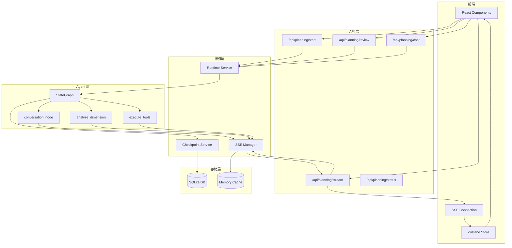

# 后端API与数据流

本文档详细说明后端 API 路由结构、SSE 管理机制和数据持久化方案。

## 目录

- [API路由结构](#api路由结构)
- [SSE管理器](#sse管理器)
- [状态存储](#状态存储)
- [数据持久化](#数据持久化)
- [数据流图](#数据流图)

---

## API路由结构

### 路由概览

后端提供以下 REST API 端点:

| 路由 | 方法 | 功能 | 文件 |
|------|------|------|------|
| `/api/planning/start` | POST | 启动规划会话 | `startup.py` |
| `/api/planning/stream/{session_id}` | GET | SSE 事件流 | `stream.py` |
| `/api/planning/review/{session_id}` | POST | 审查操作 (approve/reject) | `review.py` |
| `/api/planning/chat/{session_id}` | POST | 对话交互 | `chat.py` |
| `/api/planning/status/{session_id}` | GET | 状态查询 | `session.py` |
| `/api/planning/checkpoint/{session_id}` | GET | 检查点列表 | `checkpoint.py` |
| `/api/planning/message/{session_id}` | GET/POST | 消息管理 | `message.py` |

### 启动规划会话

```python
# backend/api/planning/startup.py (概念示例)
@router.post("/api/planning/start")
async def start_planning(request: StartPlanningRequest):
    """
    启动新的规划会话

    Args:
        request: 包含 village_name, village_data, task_description 等

    Returns:
        session_id: 新会话的 ID
    """
    session_id = str(uuid.uuid4())

    # 初始化会话状态
    initial_state = create_initial_state(
        session_id=session_id,
        project_name=request.village_name,
        village_data=request.village_data,
        task_description=request.task_description,
    )

    # 存储到数据库
    await create_planning_session(session_id, initial_state)

    # 启动异步执行
    asyncio.create_task(run_planning_async(session_id))

    return {"session_id": session_id}
```

### SSE 流端点

```python
# backend/api/planning/stream.py
@router.get("/api/planning/stream/{session_id}")
async def stream_planning(session_id: str):
    """
    SSE 事件流端点

    返回 Server-Sent Events 流，包含规划过程的所有事件。
    """
    # 从数据库恢复会话（如果内存中没有）
    if not sse_manager.session_exists(session_id):
        rebuilt = await checkpoint_service.rebuild_session_from_db(
            session_id, get_planning_session_async, sse_manager
        )
        if not rebuilt:
            raise HTTPException(status_code=404, detail=f"Session not found: {session_id}")

    async def event_generator():
        queue = await PlanningRuntimeService.subscribe_with_history(session_id)

        try:
            # 立即发送 connected 事件
            yield sse_manager.format_sse({
                "type": "connected",
                "session_id": session_id,
                "timestamp": datetime.now().isoformat()
            })

            while True:
                try:
                    # 30秒超时等待事件
                    event = await asyncio.wait_for(queue.get(), timeout=30.0)

                    event_type = event.get("type", "")
                    if event_type in ["completed", "error"]:
                        yield sse_manager.format_sse(event)
                        break

                    yield sse_manager.format_sse(event)

                except asyncio.TimeoutError:
                    # 发送心跳
                    yield sse_manager.format_sse({
                        "type": "heartbeat",
                        "timestamp": datetime.now().isoformat()
                    })

        except asyncio.CancelledError:
            logger.info(f"[Planning API] [{session_id}] SSE 连接被取消")
        finally:
            await sse_manager.unsubscribe(session_id, queue)

    return StreamingResponse(
        event_generator(),
        media_type="text/event-stream",
        headers={
            "Cache-Control": "no-cache",
            "Connection": "keep-alive",
            "X-Accel-Buffering": "no",
        }
    )
```

### 终止事件处理机制

当收到终止事件（`pause`、`stream_paused`、`completed`）时，前端立即关闭 SSE 连接，
并设置抑制重连标记，阻止浏览器自动重连：

```typescript
// frontend/src/lib/api/planning-api.ts
let shouldSuppressReconnect = false;

// pause 事件处理 - 立即关闭，阻止浏览器自动重连
es.addEventListener('pause', (e) => {
  parseEvent(e, 'pause');
  shouldSuppressReconnect = true;  // 设置抑制标记
  if (es.readyState !== EventSource.CLOSED) {
    es.close();
    console.log('[SSE] Connection closed after pause event');
  }
});

// completed 事件处理
es.addEventListener('completed', (e) => {
  parseEvent(e, 'completed');
  shouldSuppressReconnect = true;
  if (es.readyState !== EventSource.CLOSED) {
    es.close();
    console.log('[SSE] Connection closed after completed event');
  }
});

// 错误处理中检查抑制标记
es.onerror = () => {
  if (es.readyState === EventSource.CONNECTING) {
    if (shouldSuppressReconnect) {
      // 抑制自动重连日志 - 这是预期的断开
      return;
    }
    console.log('[SSE] Connection lost, browser is auto-reconnecting...');
  }
};
```

**设计原则**：
- **立即关闭**：收到终止事件后立即调用 `es.close()`，不使用延迟
- **抑制重连**：设置标记阻止浏览器自动重连时的误导性日志
- **避免竞争**：防止延迟关闭期间浏览器自动重连与 approve 流程产生竞争

---

## SSE管理器

### SSEManager 类设计

SSE 管理器是一个类方法驱动的单例，负责:

1. 管理订阅者连接
2. 事件缓存防止丢失
3. 跨线程安全发布
4. 会话生命周期管理

```python
# backend/services/sse_manager.py
class SSEManager:
    """
    集中式 SSE 连接和事件管理

    Features:
    - 线程安全的订阅者管理
    - 每个连接独立的事件队列
    - 跨线程安全的事件发布
    - 历史事件同步
    """

    # 缓存配置: event_type -> (cache_attr, key_field)
    CACHE_CONFIG = {
        SSEEventType.DIMENSION_START: ("_last_dimension_start", "dimension_key"),
        SSEEventType.DIMENSION_COMPLETE: ("_last_dimension_complete", "dimension_key"),
        SSEEventType.LAYER_COMPLETED: ("_last_layer_completed", "layer"),
        SSEEventType.LAYER_STARTED: ("_last_layer_started", "layer"),
        SSEEventType.RESUMED: ("_last_resumed", None),
    }

    # 全局状态
    _sessions: Dict[str, Dict[str, Any]] = {}
    _session_subscribers: Dict[str, Set[asyncio.Queue]] = {}

    # 线程安全锁
    _sessions_lock = Lock()
    _subscribers_lock = Lock()
    _cache_lock = RLock()

    # 主事件循环引用（用于跨线程发布）
    _main_event_loop: asyncio.AbstractEventLoop = None
```

### 连接订阅机制

```python
@classmethod
async def subscribe(cls, session_id: str) -> asyncio.Queue:
    """
    订阅会话的事件流

    创建独立队列并同步:
    1. 缓存的关键事件（优先级最高）
    2. 历史事件

    Args:
        session_id: 会话 ID

    Returns:
        asyncio.Queue: 该连接的独立队列
    """
    queue = asyncio.Queue(maxsize=500)

    with cls._subscribers_lock:
        if session_id not in cls._session_subscribers:
            cls._session_subscribers[session_id] = set()
        cls._session_subscribers[session_id].add(queue)

    # 缓存事件优先同步（关键事件优先入队列）
    # 同步顺序: layer_started > layer_completed > resumed > dimension_complete > historical

    # 1. cached_layer_started (最高优先级)
    with cls._layer_started_cache_lock:
        if session_id in cls._last_layer_started:
            for layer, event in cls._last_layer_started[session_id].items():
                try:
                    queue.put_nowait(event)
                except asyncio.QueueFull:
                    logger.warning(f"Queue full, dropping cached layer_started")
                    break

    # 2. cached_dimension_complete
    with cls._dimension_cache_lock:
        if session_id in cls._last_dimension_complete:
            for dim_key, event in cls._last_dimension_complete[session_id].items():
                try:
                    queue.put_nowait(event)
                except asyncio.QueueFull:
                    break

    # 3. historical events (最低优先级)
    with cls._sessions_lock:
        if session_id in cls._sessions:
            events = cls._sessions[session_id].get("events", [])
            for event in events:
                try:
                    queue.put_nowait(event)
                except asyncio.QueueFull:
                    break

    return queue
```

### 事件缓存配置

缓存机制防止无订阅者时事件丢失:

```python
# 缓存 dimension_complete 事件: session_id -> dimension_key -> event
_last_dimension_complete: Dict[str, Dict[str, Dict[str, Any]]] = {}

# 缓存 dimension_start 事件: session_id -> dimension_key -> event
_last_dimension_start: Dict[str, Dict[str, Dict[str, Any]]] = {}

# 缓存 layer_completed 事件: session_id -> layer -> event
_last_layer_completed: Dict[str, Dict[int, Dict[str, Any]]] = {}

# 缓存 layer_started 事件: session_id -> layer -> event
_last_layer_started: Dict[str, Dict[int, Dict[str, Any]]] = {}

# 缓存 resumed 事件: session_id -> event
_last_resumed: Dict[str, Dict[str, Any]] = {}
```

### 跨线程安全发布

```python
@classmethod
def publish_sync(cls, session_id: str, event: Dict[str, Any]) -> None:
    """
    从同步上下文发布事件（跨线程安全）

    使用保存的主事件循环从 LLM 回调安全发布。

    Args:
        session_id: 会话 ID
        event: 事件字典
    """
    event_type = event.get("type", "unknown")

    loop = cls._main_event_loop
    if loop is None:
        try:
            loop = asyncio.get_running_loop()
        except RuntimeError:
            logger.warning(f"No event loop for {event_type}")
            return

    try:
        asyncio.run_coroutine_threadsafe(
            cls.publish(session_id, event),
            loop
        )
    except Exception as e:
        logger.error(f"Failed to publish {event_type}: {e}")
```

### 会话清理

```python
# backend/constants/__init__.py
SESSION_TTL_HOURS = 24
EVENT_CLEANUP_INTERVAL_SECONDS = 3600  # 1小时

# backend/api/planning/startup.py
async def _session_cleanup_loop() -> None:
    """会话清理循环"""
    while True:
        try:
            await asyncio.sleep(EVENT_CLEANUP_INTERVAL_SECONDS)

            cutoff_time = datetime.now() - timedelta(hours=SESSION_TTL_HOURS)
            cleaned = sse_manager.cleanup_expired_sessions(cutoff_time)

            total = sum(cleaned.values())
            if total > 0:
                logger.info(f"[Session Cleanup] 清理完成: {cleaned}")

        except asyncio.CancelledError:
            break
        except Exception as e:
            logger.error(f"[Session Cleanup] 清理失败: {e}")
```

---

## 状态存储

### LangGraph Checkpoint 作为 SSOT

系统使用 LangGraph Checkpoint 作为状态的唯一真实来源 (SSOT):

```python
# src/orchestration/main_graph.py
def create_unified_planning_graph(checkpointer=None) -> StateGraph:
    """
    创建统一规划图（Router Agent 架构）

    单一 State，消灭双写问题。
    Checkpoint 完整记录聊天+规划。
    """
    builder = StateGraph(UnifiedPlanningState)

    # 添加节点...
    # 编译图
    graph = builder.compile(checkpointer=checkpointer)

    return graph
```

### 会话恢复机制

当 SSE 连接断开后重连，系统从数据库恢复会话状态:

```python
# backend/services/checkpoint_service.py
async def rebuild_session_from_db(
    session_id: str,
    get_session_fn: Callable,
    sse_manager: SSEManager
) -> bool:
    """
    从数据库重建会话状态

    Args:
        session_id: 会话 ID
        get_session_fn: 异步获取会话的函数
        sse_manager: SSE 管理器实例

    Returns:
        是否成功重建
    """
    try:
        session = await get_session_fn(session_id)
        if not session:
            return False

        # 恢复会话状态
        sse_manager.init_session(session_id, {
            "events": deque(maxlen=500),
            "created_at": session.created_at,
            "updated_at": session.updated_at,
        })

        # 恢复执行状态
        if session.status == "running":
            sse_manager.set_execution_active(session_id, True)
            sse_manager.set_stream_state(session_id, "active")

        return True
    except Exception as e:
        logger.error(f"Failed to rebuild session: {e}")
        return False
```

---

## 数据持久化

### PlanningSession 表结构

```sql
-- 简化的表结构示意
CREATE TABLE planning_sessions (
    id TEXT PRIMARY KEY,
    village_id TEXT,
    village_name TEXT,
    status TEXT,  -- 'running', 'paused', 'completed', 'error'
    phase TEXT,
    reports JSON,  -- {layer1: {}, layer2: {}, layer3: {}}
    config JSON,
    created_at TIMESTAMP,
    updated_at TIMESTAMP,
    execution_error TEXT,
    last_checkpoint_id TEXT
);
```

### UIMessage 表和 Upsert 机制

```sql
CREATE TABLE ui_messages (
    id TEXT PRIMARY KEY,
    session_id TEXT,
    role TEXT,  -- 'user' or 'assistant'
    type TEXT,  -- 'text', 'layer_completed', 'dimension_report', etc.
    content TEXT,
    metadata JSON,
    created_at TIMESTAMP,
    UNIQUE(session_id, id)  -- 支持 upsert
);
```

### SQLite WAL 模式配置

```python
# backend/database/connection.py
async def init_db():
    """初始化数据库连接"""
    engine = create_async_engine(DATABASE_URL)

    async with engine.begin() as conn:
        # 启用 WAL 模式提高并发性能
        await conn.execute(text("PRAGMA journal_mode=WAL"))
        await conn.execute(text("PRAGMA synchronous=NORMAL"))
        await conn.execute(text("PRAGMA cache_size=-64000"))  # 64MB
```

---

## 数据流图

### API层与Agent层的数据流



### SSE 事件发布流程

```mermaid
sequenceDiagram
    participant Agent as LangGraph Agent
    participant Publisher as SSEPublisher
    participant Manager as SSEManager
    participant Queue as asyncio.Queue
    participant Frontend as SSE Client

    Agent->>Publisher: send_dimension_complete()
    Publisher->>Publisher: create event dict

    Publisher->>Manager: publish_sync(session_id, event)

    Note over Manager: Cache event (dimension_complete)

    Manager->>Manager: check subscribers

    alt 有订阅者
        for each queue in subscribers
            Manager->>Queue: put_nowait(event)
        end
    else 无订阅者
        Note over Manager: Event cached, will sync on reconnect
    end

    Queue-->>Frontend: queue.get() returns event
    Frontend->>Frontend: format_sse(event)
    Frontend->>Frontend: yield to client
```

---

## SSE 事件类型

定义在 `backend/constants/sse_events.py`:

```python
class SSEEventType(str):
    """SSE 事件类型常量"""

    # 连接事件
    CONNECTED = "connected"
    HEARTBEAT = "heartbeat"
    COMPLETED = "completed"
    ERROR = "error"
    RESUMED = "resumed"
    PAUSE = "pause"

    # 层级事件
    LAYER_STARTED = "layer_started"
    LAYER_COMPLETED = "layer_completed"

    # 维度事件
    DIMENSION_START = "dimension_start"
    DIMENSION_COMPLETE = "dimension_complete"
    DIMENSION_DELTA = "dimension_delta"

    # AI 响应事件
    AI_RESPONSE_DELTA = "ai_response_delta"
    AI_RESPONSE_COMPLETE = "ai_response_complete"

    # 检查点事件
    CHECKPOINT_SAVED = "checkpoint_saved"
    REVISION_COMPLETED = "revision_completed"

    # 工具事件
    TOOL_CALL = "tool_call"
    TOOL_PROGRESS = "tool_progress"
    TOOL_RESULT = "tool_result"
```

---

## 关键代码路径

| 功能 | 文件路径 | 关键类/函数 |
|------|----------|-------------|
| SSE 管理 | `backend/services/sse_manager.py` | `SSEManager` 类 |
| 流端点 | `backend/api/planning/stream.py` | `stream_planning` |
| 检查点服务 | `backend/services/checkpoint_service.py` | `rebuild_session_from_db` |
| 事件类型 | `backend/constants/sse_events.py` | `SSEEventType` |
| SSE 发布器 | `src/utils/sse_publisher.py` | `SSEPublisher` 类 |
| 会话清理 | `backend/api/planning/startup.py` | `_session_cleanup_loop` |

---

## 相关文档

- [前端状态管理](./frontend-state-dataflow.md) - 前端状态架构
- [Agent核心实现](./agent-core-implementation.md) - Router Agent 架构
- [工具系统实现](./tool-system-implementation.md) - Tool 注册和执行