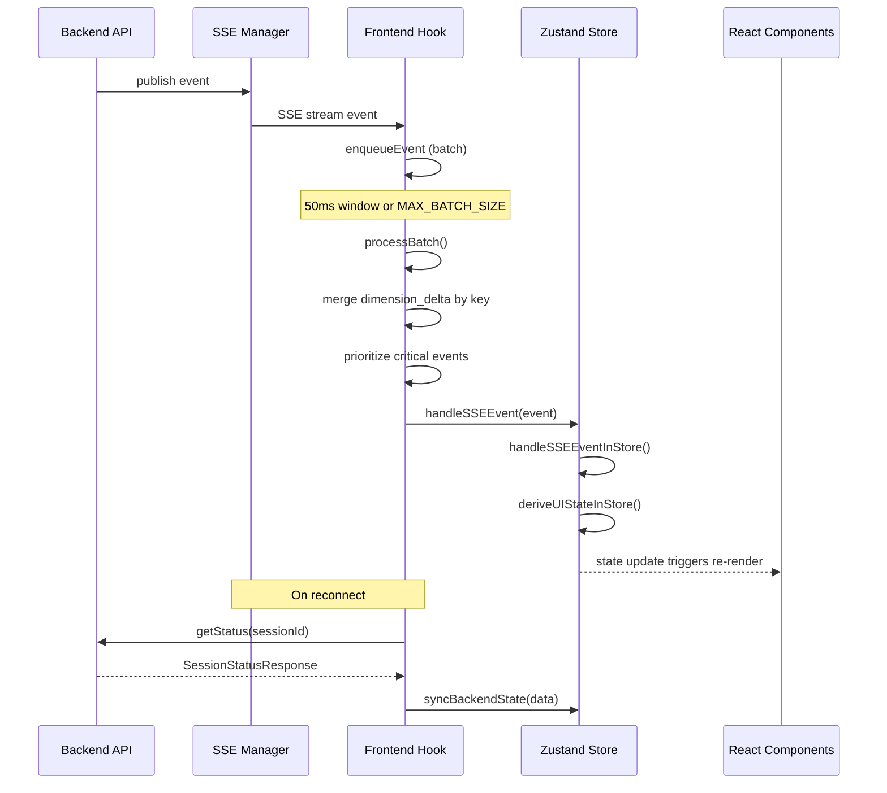
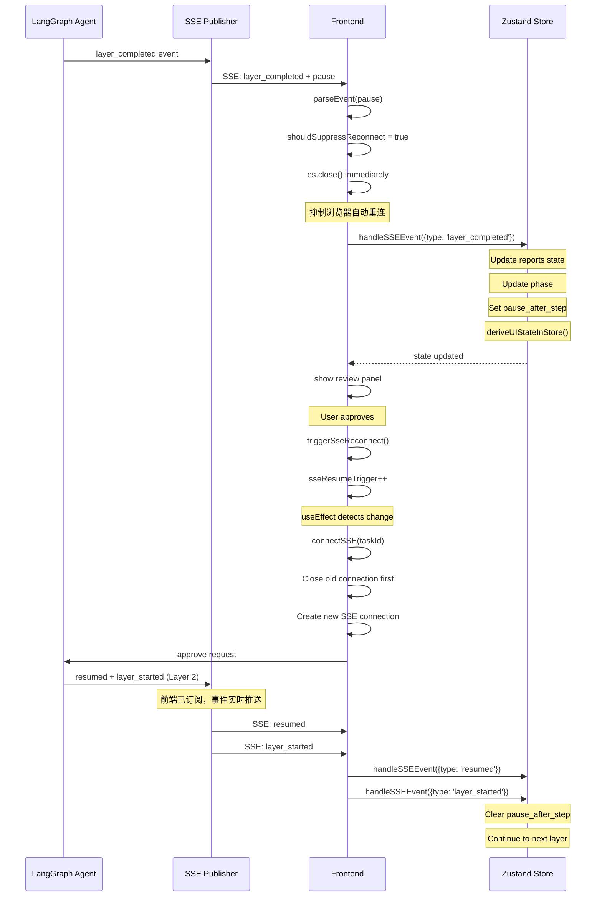

# 前端状态管理与数据流

本文档详细说明前端状态管理架构、SSE事件处理机制和UI数据流。

## 目录

- [状态管理架构](#状态管理架构)
- [SSE事件处理](#sse事件处理)
- [Signal-Fetch模式](#signal-fetch模式)
- [消息类型系统](#消息类型系统)
- [数据流序列图](#数据流序列图)

---

## 状态管理架构

### Zustand + Immer 中间件

项目使用 Zustand 作为状态管理库，配合 Immer 中间件实现不可变状态更新。

```typescript
// frontend/src/stores/planningStore.ts
import { create } from 'zustand';
import { immer } from 'zustand/middleware/immer';

export const usePlanningStore = create<PlanningState & PlanningActions>()(
  immer((set, _get) => ({
    // 状态和 actions
  }))
);
```

### PlanningState 接口定义

核心状态接口定义在 `frontend/src/stores/planningStore.ts:70-129`:

```typescript
export interface PlanningState {
  conversationId: string;

  // Session
  taskId: string | null;
  projectName: string | null;
  status: Status;

  // Agent State (Single Source of Truth)
  phase: string;
  currentWave: number;
  reports: Reports;
  pause_after_step: boolean;
  previous_layer: number;
  step_mode: boolean;

  // Derived UI State
  completedDimensions: CompletedDimensions;
  currentLayer: number | null;
  currentPhase: LayerPhase | '修复中';
  completedLayers: { 1: boolean; 2: boolean; 3: boolean };
  isPaused: boolean;
  pendingReviewLayer: number | null;

  // SSE Reconnect
  sseResumeTrigger: number;

  // Messages
  messages: Message[];

  // Progress
  dimensionProgress: Record<string, DimensionProgressItem>;
  executingDimensions: string[];

  // UI State
  viewerVisible: boolean;
  viewingFile: FileMessage | null;
  // ... 更多 UI 状态

  // Tools
  toolStatuses: Record<string, ToolStatus>;
}
```

### 派生状态计算

`deriveUIStateInStore` 函数负责从核心状态派生 UI 状态:

```typescript
function deriveUIStateInStore(state: PlanningState): void {
  const currentLayer = phaseToLayer(state.phase);

  // 从 reports 派生 completedDimensions
  const newCompletedDimensions = deriveCompletedDimensions(state.reports);

  // 使用稳定引用避免不必要的重渲染
  if (!shallowEqualCompletedDimensions(newCompletedDimensions, state.completedDimensions)) {
    state.completedDimensions = newCompletedDimensions;
  }

  // 派生 completedLayers
  state.completedLayers = {
    1: state.completedDimensions.layer1.length > 0,
    2: state.completedDimensions.layer2.length > 0,
    3: state.completedDimensions.layer3.length > 0,
  };

  // 派生暂停状态
  state.isPaused = state.pause_after_step === true;
  state.pendingReviewLayer =
    state.isPaused && state.previous_layer > 0 ? state.previous_layer : null;

  state.currentLayer = currentLayer;
  state.currentPhase = currentLayer ? getLayerPhase(currentLayer) : 'idle';
}
```

### Actions 接口和高层 Hook

Actions 接口定义了所有状态更新方法:

```typescript
export interface PlanningActions {
  // Core setters
  setTaskId: (taskId: string | null) => void;
  setProjectName: (projectName: string | null) => void;
  setStatus: (status: Status) => void;

  // Messages
  addMessage: (message: Message) => void;
  setMessages: (messages: Message[]) => void;

  // Backend sync
  syncBackendState: (backendData: Partial<SessionStatusResponse>) => void;

  // SSE Event handling
  handleSSEEvent: (event: StoreEvent) => void;

  // Reset
  resetConversation: () => void;
  initConversation: (conversationId: string) => void;
}
```

---

## SSE事件处理

### 批量处理机制

前端使用批量处理机制优化高频 SSE 事件，避免过多渲染:

```typescript
// frontend/src/hooks/planning/useSSEConnection.ts
const BATCH_WINDOW = 50; // 50ms 窗口
const MAX_BATCH_SIZE = 50; // 队列最大事件数

const processBatch = useCallback(() => {
  const events = batchQueueRef.current;
  batchQueueRef.current = [];

  if (events.length === 0) return;

  // 关键事件类型 - 不合并，立即发送
  const criticalEventTypes = ['dimension_start', 'dimension_complete', 'layer_completed', 'layer_started'];

  // 分组处理
  const dimensionDeltaMap = new Map<string, BatchEvent>();
  const criticalEvents: BatchEvent[] = [];
  const otherEvents: BatchEvent[] = [];

  for (const event of events) {
    if (criticalEventTypes.includes(event.type)) {
      criticalEvents.push(event);
    } else if (event.type === 'dimension_delta') {
      // dimension_delta 按维度键合并，只保留最后一个
      const data = event.data as { layer?: number; dimension_key?: string };
      const key = `${data.layer || 1}_${data.dimension_key || ''}`;
      dimensionDeltaMap.set(key, event);
    } else {
      otherEvents.push(event);
    }
  }

  // 先发送关键事件
  for (const event of criticalEvents) {
    handleSSEEvent(event);
  }

  // 发送合并后的 dimension_delta
  for (const event of dimensionDeltaMap.values()) {
    handleSSEEvent(event);
  }

  // 发送其他事件
  for (const event of otherEvents) {
    handleSSEEvent(event);
  }
}, [handleSSEEvent]);
```

### 事件入队和强制刷新

```typescript
const enqueueEvent = useCallback(
  (event: BatchEvent) => {
    batchQueueRef.current.push(event);

    // 队列超过最大值时强制刷新
    if (batchQueueRef.current.length >= MAX_BATCH_SIZE) {
      if (batchTimeoutRef.current) {
        clearTimeout(batchTimeoutRef.current);
        batchTimeoutRef.current = null;
      }
      processBatch();
      return;
    }

    // 设置延迟处理
    if (!batchTimeoutRef.current) {
      batchTimeoutRef.current = setTimeout(() => {
        batchTimeoutRef.current = null;
        processBatch();
      }, BATCH_WINDOW);
    }
  },
  [processBatch]
);
```

### 重连机制

SSE 连接支持自动重连，使用指数退避策略。关键改进：**建立新连接前先关闭旧连接**。

```typescript
const MAX_RECONNECT_ATTEMPTS = 5;

// connectSSE 函数 - 先关闭旧连接再建立新连接
const connectSSE = useCallback(
  (taskIdParam: string) => {
    // Close old connection first to prevent race conditions
    if (sseConnectionRef.current) {
      const oldEs = sseConnectionRef.current;
      sseConnectionRef.current = null;  // Clear ref immediately to prevent reuse
      oldEs.close();
      console.log('[useSSEConnection] Closed old SSE connection before reconnect');
    }

    const es = planningApi.createStream(
      taskIdParam,
      (event: PlanningSSEEvent) => {
        reconnectAttemptsRef.current = 0;
        enqueueEvent({ type: event.type, data: event.data });
      },
      (error) => {
        // 错误处理中的重连逻辑
        if (reconnectAttemptsRef.current < MAX_RECONNECT_ATTEMPTS) {
          reconnectAttemptsRef.current++;
          const delay = Math.min(1000 * reconnectAttemptsRef.current, 5000);
          setTimeout(() => {
            const currentTaskId = usePlanningStore.getState().taskId;
            if (currentTaskId) {
              connectSSE(currentTaskId);
            }
          }, delay);
        }
      },
      // onReconnect callback
      () => {
        const currentTaskId = usePlanningStore.getState().taskId;
        if (currentTaskId) {
          planningApi.getStatus(currentTaskId).then((statusData) => {
            syncBackendState(statusData);
          });
        }
        onReconnect?.();
      }
    );

    sseConnectionRef.current = es;
    return es;
  },
  [enqueueEvent, syncBackendState, onReconnect]
);
```

**设计要点**：
- **立即清理引用**：将 `sseConnectionRef.current` 设为 `null` 在关闭前，防止竞争条件下复用旧连接
- **先关后连**：避免旧连接与新连接的竞争，确保只有一个活跃连接
- **指数退避**：重连间隔从 1s 递增到最大 5s，避免频繁重连

### approve 流程的重连触发

用户 approve 后，前端通过 `sseResumeTrigger` 值变化触发新连接：

```typescript
// frontend/src/hooks/planning/useSSEConnection.ts
useEffect(() => {
  if (!enabled || !taskId) {
    if (sseConnectionRef.current) {
      sseConnectionRef.current.close();
      sseConnectionRef.current = null;
    }
    return;
  }

  // Reconnect trigger: taskId change or resumeTrigger change
  const taskIdChanged = prevTaskIdRef.current !== taskId;
  const resumeTriggered = prevResumeTriggerRef.current !== resumeTrigger;
  const shouldReconnect = taskIdChanged || resumeTriggered;

  if (shouldReconnect) {
    prevTaskIdRef.current = taskId;
    prevResumeTriggerRef.current = resumeTrigger;
    connectSSE(taskId);  // 会先关闭旧连接
  }
}, [taskId, enabled, resumeTrigger, connectSSE]);
```

---

## Signal-Fetch模式

### 概述

系统采用 Signal-Fetch 模式优化数据传输:

1. **SSE 发送轻量信号** - 只传输事件类型和最小必要数据
2. **REST API 获取完整数据** - 客户端根据信号按需获取

### layer_completed 信号示例

当层级完成时，SSE 只发送信号:

```typescript
// SSE 事件
{
  type: 'layer_completed',
  layer: 1,
  phase: 'layer1',
  dimension_reports: { ... }  // 包含报告数据
}
```

前端收到信号后，通过 REST API 获取完整的层级报告:

```typescript
// frontend/src/lib/api/planning-api.ts
async getLayerReports(sessionId: string, layer: number): Promise<LayerReportsResponse> {
  const response = await fetch(`${API_BASE_URL}/api/planning/reports/${sessionId}/${layer}`);
  return response.json();
}
```

### 数据一致性保证

系统通过以下机制保证数据一致性:

1. **Checkpoint 作为 SSOT** - LangGraph Checkpoint 是状态的唯一真实来源
2. **版本控制** - 状态中包含 version 字段，支持乐观锁
3. **状态同步** - SSE 重连时自动从后端同步完整状态

```typescript
// frontend/src/stores/planningStore.ts
syncBackendState: (backendData) =>
  set((state) => {
    const hasStatusChange = backendData.status !== state.status;
    const hasPhaseChange = backendData.phase !== state.phase;
    const hasPauseChange = backendData.pause_after_step !== state.pause_after_step;
    const hasPreviousLayerChange = backendData.previous_layer !== state.previous_layer;
    const hasReportsChange = !shallowEqualReports(backendData.reports, state.reports);

    if (!hasStatusChange && !hasPhaseChange && !hasPauseChange &&
        !hasPreviousLayerChange && !hasReportsChange) {
      return; // 无变化，跳过更新
    }

    // 应用更新...
    deriveUIStateInStore(state);
  }),
```

---

## 消息类型系统

### Message 类型联合定义

消息类型定义在 `frontend/src/types/message/message-types.ts`:

```typescript
// 核心消息类型
export interface TextMessage extends BaseMessage {
  type: 'text';
  content: string;
  streamingState?: 'idle' | 'streaming' | 'paused' | 'completed';
  knowledgeReferences?: KnowledgeReference[];
}

export interface DimensionReportMessage extends BaseMessage {
  type: 'dimension_report';
  layer: number;
  dimensionKey: string;
  dimensionName: string;
  content: string;
  streamingState: 'streaming' | 'completed' | 'error';
  wordCount: number;
  isRevision?: boolean;
}

export interface LayerCompletedMessage extends BaseMessage {
  type: 'layer_completed';
  layer: number;
  content: string;
  summary: {
    word_count: number;
    key_points: string[];
    dimension_count?: number;
  };
  fullReportContent?: string;
  dimensionReports?: Record<string, string>;
  actions: ActionButton[];
}

// 工具消息类型（合并为统一的 ToolStatusMessage）
export interface ToolStatusMessage extends BaseMessage {
  type: 'tool_status';
  toolName: string;
  toolDisplayName: string;
  description: string;
  status: 'pending' | 'running' | 'success' | 'error';
  progress?: number;
  stage?: string;
  stageMessage?: string;
  summary?: string;
  error?: string;
  estimatedTime?: number;
}

// 新增 GIS 结果消息
export interface GisResultMessage extends BaseMessage {
  type: 'gis_result';
  dimensionKey: string;
  dimensionName: string;
  summary: string;
  layers: GISLayerConfig[];
  mapOptions?: { center: [number, number]; zoom: number };
  analysisData?: {
    overallScore?: number;
    suitabilityLevel?: string;
    recommendations?: string[];
  };
}
```

### 类型守卫函数

使用类型守卫进行类型安全检查:

```typescript
function isLayerCompletedMessage(message: Message): message is LayerCompletedMessage {
  return message.type === 'layer_completed';
}

function isDimensionReportMessage(message: Message): message is DimensionReportMessage {
  return message.type === 'dimension_report';
}

function isToolStatusMessage(message: Message): message is ToolStatusMessage {
  return message.type === 'tool_status';
}

function isGisResultMessage(message: Message): message is GisResultMessage {
  return message.type === 'gis_result';
}
```

### 后端消息转换

后端 SSE 事件通过 `handleSSEEventInStore` 函数转换为前端消息:

```typescript
function handleSSEEventInStore(state: PlanningState, event: StoreEvent): void {
  const eventType = event.type;
  const data = (event.data as Record<string, unknown>) || {};

  switch (eventType) {
    case 'layer_started': {
      // 创建 layer_report 消息框架
      const layerReportId = buildLayerReportId(layerNum);
      const newMessage: LayerCompletedMessage = {
        ...baseMsg,
        id: layerReportId,
        type: 'layer_completed',
        layer: layerNum,
        content: '',
        summary: { word_count: 0, key_points: [], dimension_count: 0 },
        fullReportContent: '',
        dimensionReports: {},
        actions: [],
      };
      state.messages.push(newMessage);
      break;
    }

    case 'dimension_delta': {
      // 更新 dimensionReports
      if (layerMsgIdx >= 0 && dimensionKey && dimData.accumulated) {
        const layerMsg = state.messages[layerMsgIdx] as LayerCompletedMessage;
        if (!layerMsg.dimensionReports) {
          layerMsg.dimensionReports = {};
        }
        layerMsg.dimensionReports[dimensionKey] = dimData.accumulated;
      }
      break;
    }
  }
}
```

---

## 数据流序列图

### SSE 事件处理完整流程



### 层级完成事件流



---

## 关键代码路径

| 功能 | 文件路径 | 关键函数 |
|------|----------|----------|
| 状态定义 | `frontend/src/stores/planningStore.ts` | `PlanningState`, `PlanningActions` |
| SSE事件处理 | `frontend/src/stores/planningStore.ts` | `handleSSEEventInStore` |
| 批量处理 | `frontend/src/hooks/planning/useSSEConnection.ts` | `processBatch`, `enqueueEvent` |
| API 调用 | `frontend/src/lib/api/planning-api.ts` | `createStream`, `getStatus` |
| 消息类型 | `frontend/src/types/message/message-types.ts` | `Message` 类型联合 |
| 派生状态 | `frontend/src/stores/planningStore.ts` | `deriveUIStateInStore` |

---

## 相关文档

- [后端API与数据流](./backend-api-dataflow.md) - 后端 API 路由和 SSE 管理
- [Agent核心实现](./agent-core-implementation.md) - Router Agent 架构
- [维度与层级数据流](./layer-dimension-dataflow.md) - 三层规划架构