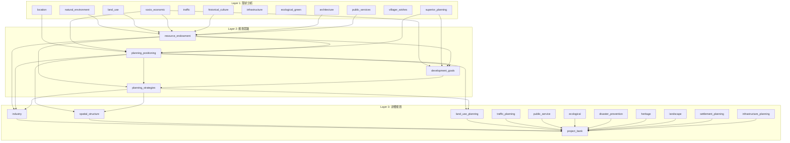
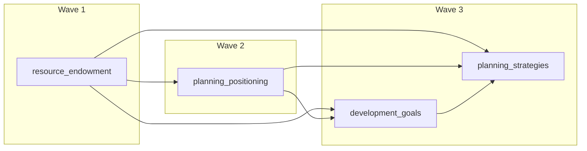

# 维度与层级数据流

本文档详细说明三层规划架构、维度依赖关系和数据传递机制。

## 目录

- [三层架构概览](#三层架构概览)
- [维度元数据配置](#维度元数据配置)
- [依赖链机制](#依赖链机制)
- [数据传递流程](#数据传递流程)
- [依赖关系图](#依赖关系图)

---

## 三层架构概览

### 架构说明

村庄规划采用三层递进式架构:

| 层级 | 名称 | 维度数 | 执行模式 | 说明 |
|------|------|--------|----------|------|
| Layer 1 | 现状分析 | 12 | Map-Reduce 并行 | 分析村庄现状各方面 |
| Layer 2 | 规划思路 | 4 | Wave 波次执行 | 确定规划方向和策略 |
| Layer 3 | 详细规划 | 12 | Wave 波次执行 | 制定具体规划方案 |

### Layer 1: 现状分析

12个维度，无内部依赖，可完全并行执行:

```
┌─────────────────────────────────────────────────────────────────┐
│                        Layer 1: 现状分析                         │
├─────────────────────────────────────────────────────────────────┤
│ location         │ 区位与对外交通分析                              │
│ socio_economic   │ 社会经济分析                                    │
│ villager_wishes  │ 村民意愿与诉求分析                              │
│ superior_planning│ 上位规划与政策导向分析                          │
│ natural_environment│ 自然环境分析                                  │
│ land_use         │ 土地利用分析                                    │
│ traffic          │ 道路交通分析                                    │
│ public_services  │ 公共服务设施分析                                │
│ infrastructure   │ 基础设施分析                                    │
│ ecological_green │ 生态绿地分析                                    │
│ architecture     │ 建筑分析                                        │
│ historical_culture│ 历史文化与乡愁保护分析                         │
└─────────────────────────────────────────────────────────────────┘
          ↓ (全部完成后进入 Layer 2)
```

### Layer 2: 规划思路

4个维度，存在依赖关系，按 Wave 执行:

```
┌─────────────────────────────────────────────────────────────────┐
│                        Layer 2: 规划思路                          │
├─────────────────────────────────────────────────────────────────┤
│ Wave 1:                                                          │
│   resource_endowment    │ 资源禀赋分析 (依赖多个 Layer 1 维度)    │
│                        │                                          │
│ Wave 2:                                                          │
│   planning_positioning  │ 规划定位分析 (依赖 resource_endowment)  │
│                        │                                          │
│ Wave 3:                                                          │
│   development_goals     │ 发展目标分析 (依赖 resource_endowment,  │
│                        │                   planning_positioning)   │
│   planning_strategies   │ 规划策略分析 (依赖前3个维度)            │
└─────────────────────────────────────────────────────────────────┘
          ↓ (全部完成后进入 Layer 3)
```

### Layer 3: 详细规划

12个维度，部分存在依赖关系:

```
┌─────────────────────────────────────────────────────────────────┐
│                        Layer 3: 详细规划                          │
├─────────────────────────────────────────────────────────────────┤
│ Wave 1:                                                          │
│   industry             │ 产业规划                                 │
│   spatial_structure    │ 空间结构规划                             │
│   land_use_planning    │ 土地利用规划                             │
│   settlement_planning  │ 居民点规划                               │
│   traffic_planning     │ 道路交通规划                             │
│   public_service       │ 公共服务设施规划                         │
│   infrastructure_planning│ 基础设施规划                           │
│   ecological           │ 生态绿地规划                             │
│   disaster_prevention  │ 防震减灾规划                             │
│   heritage             │ 历史文保规划                             │
│   landscape            │ 村庄风貌指引                             │
│                        │                                          │
│ Wave 2:                                                          │
│   project_bank         │ 建设项目库 (依赖上述所有维度)            │
└─────────────────────────────────────────────────────────────────┘
```

---

## 维度元数据配置

### DIMENSIONS_METADATA 结构

维度配置定义在 `src/config/dimension_metadata.py`:

```python
DIMENSIONS_METADATA: Dict[str, Dict[str, Any]] = {
    # Layer 1 示例
    "location": {
        "key": "location",
        "name": "区位与对外交通分析",
        "layer": 1,
        "dependencies": [],  # Layer 1 无依赖
        "result_key": "analysis_result",
        "rag_enabled": True,
        "tool": None,
        "description": "分析村庄的地理位置、交通区位、区域关系等",
        "prompt_key": "location_analysis"
    },

    # Layer 2 示例 - 有依赖
    "planning_positioning": {
        "key": "planning_positioning",
        "name": "规划定位分析",
        "layer": 2,
        "dependencies": {
            "layer1_analyses": ["location", "socio_economic", "superior_planning"],
            "layer2_concepts": ["resource_endowment"]
        },
        "result_key": "concept_result",
        "rag_enabled": False,
        "tool": None,
        "description": "确定村庄的发展定位",
        "prompt_key": "planning_positioning"
    },

    # Layer 3 示例 - 有工具绑定
    "socio_economic": {
        "key": "socio_economic",
        "name": "社会经济分析",
        "layer": 1,
        "dependencies": [],
        "result_key": "analysis_result",
        "rag_enabled": True,
        "tool": "population_model_v1",  # 绑定人口预测工具
        "description": "分析村庄人口、经济、产业等社会经济状况",
        "prompt_key": "socio_economic_analysis"
    },
}
```

### 依赖配置格式

依赖配置使用结构化格式:

```python
# 跨层依赖示例
"dependencies": {
    "layer1_analyses": ["natural_environment", "land_use", "socio_economic"],  # 依赖 Layer 1 维度
    "layer2_concepts": ["resource_endowment"],  # 依赖 Layer 2 维度
    "layer3_plans": ["industry", "spatial_structure"]  # 依赖 Layer 3 维度（同层依赖）
}
```

### 工具绑定

通过 `tool` 字段绑定工具:

```python
# 带工具的维度配置
"traffic": {
    "key": "traffic",
    "name": "道路交通分析",
    "layer": 1,
    "tool": "accessibility_analysis",  # 可达性分析工具
    # ...
}
```

### RAG 启用

通过 `rag_enabled` 字段控制是否启用 RAG:

```python
# Layer 3 中法规相关的维度启用 RAG
"land_use_planning": {
    "key": "land_use_planning",
    "name": "土地利用规划",
    "layer": 3,
    "rag_enabled": True,  # 关键维度：涉及法规条文和技术指标
    # ...
}
```

---

## 依赖链机制

### 跨层依赖定义

跨层依赖定义了维度对其他层级维度的依赖:

```python
# src/config/dimension_metadata.py
def get_full_dependency_chain() -> Dict[str, Dict[str, Any]]:
    """
    获取完整的三层依赖关系映射

    自动计算 wave 值：基于同层内部依赖关系拓扑排序

    Returns:
        {dimension_key: {
            layer1_analyses: [...],
            layer2_concepts: [...],
            layer3_plans: [...],
            wave: N,
            depends_on_same_layer: [...]
        }}
    """
    chain = {}

    for key, config in DIMENSIONS_METADATA.items():
        layer = config.get("layer")
        deps = config.get("dependencies", {})

        if layer == 3:
            depends_on_same_layer = deps.get("layer3_plans", [])
        elif layer == 2:
            depends_on_same_layer = deps.get("layer2_concepts", [])
        else:
            depends_on_same_layer = []

        chain[key] = {
            "layer": layer,
            "layer1_analyses": deps.get("layer1_analyses", []) if layer >= 2 else [],
            "layer2_concepts": deps.get("layer2_concepts", []) if layer == 3 else [],
            "layer3_plans": deps.get("layer3_plans", []) if layer == 3 else [],
            "depends_on_same_layer": depends_on_same_layer,
            "wave": 1  # 默认值，后续自动计算
        }

    # 自动计算每个维度的 wave
    for key in chain:
        chain[key]["wave"] = _calculate_wave(key, chain)

    return chain
```

### 同层依赖和 Wave 计算

Wave 值基于同层依赖关系拓扑排序计算:

```python
def _calculate_wave(dimension_key: str, chain: Dict[str, Dict[str, Any]]) -> int:
    """
    递归计算维度的执行波次

    Wave = 1 + max(wave of dependencies within same layer)
    """
    if dimension_key not in chain:
        return 1

    deps = chain[dimension_key]
    same_layer_deps = deps.get("depends_on_same_layer", [])

    if not same_layer_deps:
        return 1

    # 递归计算依赖的 wave
    max_dep_wave = 0
    for dep_key in same_layer_deps:
        if dep_key in chain:
            dep_wave = chain[dep_key].get("wave", 1)
            if dep_wave == 1:
                dep_wave = _calculate_wave(dep_key, chain)
                chain[dep_key]["wave"] = dep_wave
            max_dep_wave = max(max_dep_wave, dep_wave)

    return max_dep_wave + 1
```

### 影响树计算

当维度修改时，需要计算级联更新的影响范围:

```python
def get_impact_tree(dimension_key: str) -> Dict[int, List[str]]:
    """
    获取维度修改后的影响树（级联更新范围）

    当一个维度被修改后，需要级联更新所有依赖它的下游维度。
    返回按 wave 分组的维度列表，支持并行调度：
    - Wave 1: 直接依赖该维度的下游维度（可并行）
    - Wave 2: 依赖 Wave 1 维度的下游维度（可并行）
    - ...

    Example:
        >>> get_impact_tree("natural_environment")
        {
            1: ["resource_endowment", "ecological", "spatial_structure"],
            2: ["planning_positioning", "planning_strategies"],
            3: ["development_goals", "project_bank"]
        }
    """
    impact_tree: Dict[int, List[str]] = {}
    visited = {dimension_key}
    current_wave_dims = [dimension_key]
    wave = 0

    while current_wave_dims:
        next_wave_dims = []
        for dim in current_wave_dims:
            downstream = get_downstream_dependencies(dim)
            for dep_dim in downstream:
                if dep_dim not in visited:
                    visited.add(dep_dim)
                    next_wave_dims.append(dep_dim)

        if next_wave_dims:
            wave += 1
            impact_tree[wave] = next_wave_dims

        current_wave_dims = next_wave_dims

    return impact_tree
```

### 下游依赖查询

```python
_DOWNSTREAM_DEPENDENCIES_CACHE = None

def get_downstream_dependencies(dimension_key: str) -> List[str]:
    """
    获取依赖指定维度的所有下游维度（反向依赖）

    用于维度修复时确定需要级联更新的下游维度。
    """
    global _DOWNSTREAM_DEPENDENCIES_CACHE

    if _DOWNSTREAM_DEPENDENCIES_CACHE is None:
        cache = {}
        for key, config in DIMENSIONS_METADATA.items():
            deps = config.get("dependencies", {})

            if isinstance(deps, list):
                continue

            for dep in deps.get("layer1_analyses", []):
                if dep not in cache:
                    cache[dep] = []
                cache[dep].append(key)

            for dep in deps.get("layer2_concepts", []):
                if dep not in cache:
                    cache[dep] = []
                cache[dep].append(key)

            for dep in deps.get("layer3_plans", []):
                if dep not in cache:
                    cache[dep] = []
                cache[dep].append(key)

        _DOWNSTREAM_DEPENDENCIES_CACHE = cache

    return _DOWNSTREAM_DEPENDENCIES_CACHE.get(dimension_key, [])
```

---

## 数据传递流程

### create_dimension_state 构建子状态

维度分析前，需要构建包含依赖数据的子状态:

```python
# src/orchestration/nodes/dimension_node.py
def create_dimension_state(
    dimension_key: str,
    parent_state: Dict[str, Any]
) -> Dict[str, Any]:
    """
    为 Send API 创建维度分析子状态

    包含:
    - 维度标识信息
    - 依赖的上下文数据
    - 执行配置
    """
    config = get_dimension_config(dimension_key)
    if not config:
        raise ValueError(f"Unknown dimension: {dimension_key}")

    # 获取依赖的上下文
    dependencies = config.get("dependencies", {})
    reports = parent_state.get("reports", {})

    # 构建 prompt 上下文
    prompt_context = _build_prompt_context(
        dimension_key=dimension_key,
        dependencies=dependencies,
        reports=reports,
        parent_state=parent_state
    )

    return {
        "dimension_key": dimension_key,
        "dimension_name": config.get("name", dimension_key),
        "layer": config.get("layer", 1),
        "result_key": config.get("result_key", "analysis_result"),
        "prompt_context": prompt_context,
        "session_id": parent_state.get("session_id", ""),
        "project_name": parent_state.get("project_name", ""),
        "config": parent_state.get("config", {}),
        "is_revision": False,
    }
```

### reports 状态传递机制

`reports` 是跨层级数据传递的核心:

```python
# 状态定义
reports: Dict[str, Dict[str, str]]  # {layer1: {dim: content}, layer2: {...}, layer3: {...}}

# 维度完成后更新
def analyze_dimension_for_send(state: Dict[str, Any]) -> Dict[str, Any]:
    # ... 执行分析

    return {
        "dimension_results": [{
            "dimension_key": dimension_key,
            "result": result_content,
            "success": True,
        }],
        "sse_events": [/* SSE 事件列表 */],
    }

# 结果收集时合并到 reports
async def collect_layer_results(state: Dict[str, Any]) -> Dict[str, Any]:
    dimension_results = state.get("dimension_results", [])
    reports = dict(state.get("reports", {}))
    layer_key = f"layer{layer}"

    for result in dimension_results:
        dim_key = result.get("dimension_key")
        if result.get("success") and dim_key:
            reports[layer_key][dim_key] = result.get("result", "")

    return {"reports": reports}
```

### completed_dimensions 追踪

`completed_dimensions` 追踪已完成的维度:

```python
# 状态定义
completed_dimensions: Dict[str, List[str]]  # {layer1: [dim1, dim2, ...], ...}

# 完成检查
def _check_layer_completion(state: Dict[str, Any], layer: int) -> Union[List[Send], str]:
    completed = state.get("completed_dimensions", {})
    layer_key = f"layer{layer}"
    completed_dims = completed.get(layer_key, [])
    total_dims = get_layer_dimensions(layer)

    pending = [d for d in total_dims if d not in completed_dims]

    if not pending:
        return "collect_results"  # 层级完成

    return [Send("analyze_dimension", create_dimension_state(d, state)) for d in pending]
```

### Revision 时的级联更新

当用户修改维度时，触发级联更新:

```python
# src/orchestration/nodes/revision_node.py
async def revision_node(state: UnifiedPlanningState) -> Dict[str, Any]:
    target_dimensions = state.get("revision_target_dimensions", [])

    # 获取需要更新的所有维度
    impact_tree = get_revision_wave_dimensions(
        target_dimensions=target_dimensions,
        completed_dimensions=get_all_completed_dimensions(state)
    )

    # 按波次执行更新
    for wave in sorted(impact_tree.keys()):
        wave_results = []
        for dim_key in impact_tree[wave]:
            result = await analyze_dimension_revision(state, dim_key)
            wave_results.append(result)

        # 等待当前波次完成
        # ...

    return {
        "need_revision": False,
        "pause_after_step": True,
    }
```

---

## 依赖关系图

### 跨层依赖关系



### Layer 2 波次执行图



---

## 关键代码路径

| 功能 | 文件路径 | 关键函数 |
|------|----------|----------|
| 维度元数据 | `src/config/dimension_metadata.py` | `DIMENSIONS_METADATA` |
| 完整依赖链 | `src/config/dimension_metadata.py` | `get_full_dependency_chain` |
| Wave 计算 | `src/config/dimension_metadata.py` | `_calculate_wave` |
| 影响树 | `src/config/dimension_metadata.py` | `get_impact_tree` |
| 下游依赖 | `src/config/dimension_metadata.py` | `get_downstream_dependencies` |
| 维度状态创建 | `src/orchestration/nodes/dimension_node.py` | `create_dimension_state` |
| 层级维度获取 | `src/orchestration/state.py` | `get_layer_dimensions`, `get_wave_dimensions` |

---

## 相关文档

- [Agent核心实现](./agent-core-implementation.md) - Router Agent 架构
- [工具系统实现](./tool-system-implementation.md) - Tool-Dimension 绑定
- [前端状态管理](./frontend-state-dataflow.md) - 前端如何展示维度进度