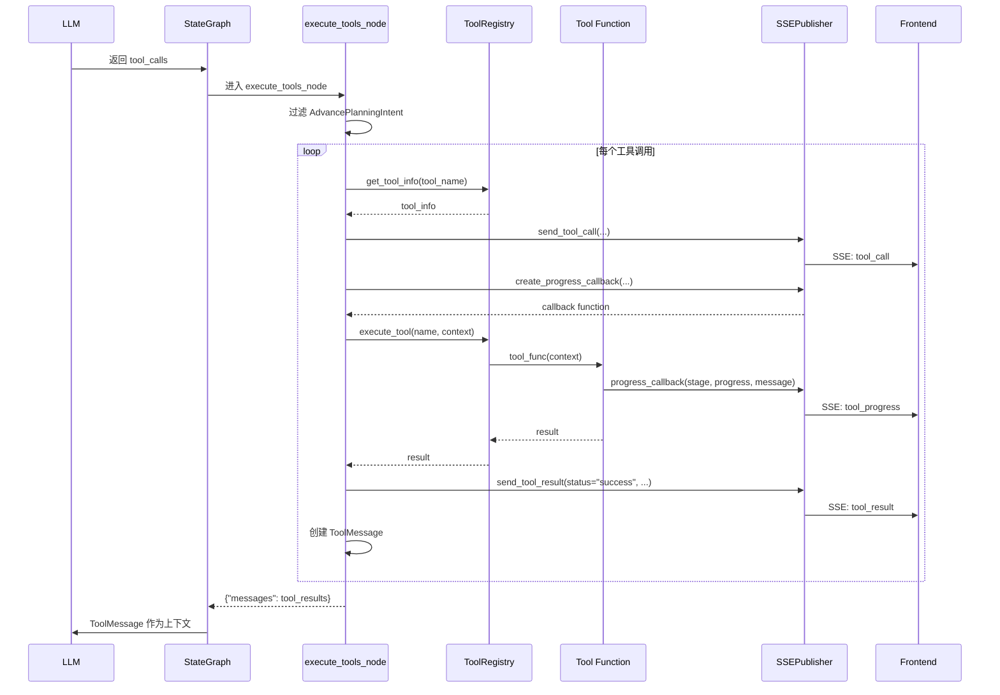
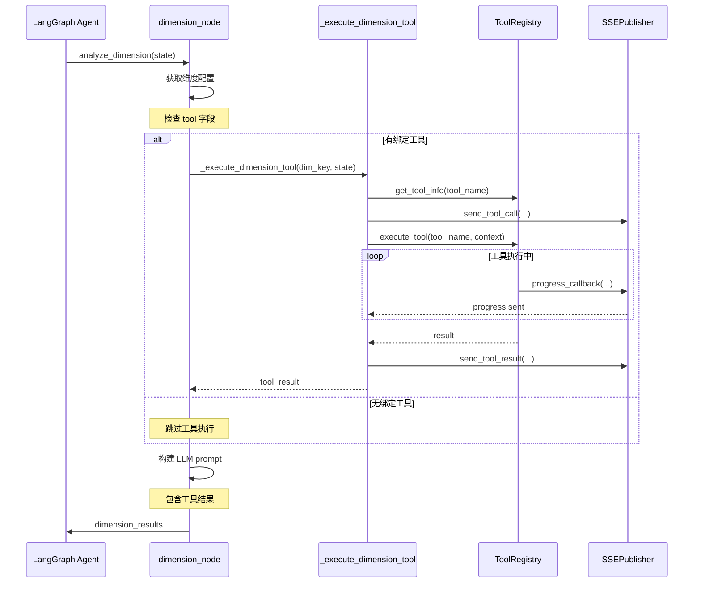

# 工具系统实现

本文档详细说明 Tool 注册机制、工具实现和 Tool-Dimension 绑定。

## 目录

- [Tool注册机制](#tool注册机制)
- [内置工具实现](#内置工具实现)
- [Tool-Dimension绑定](#tool-dimension绑定)
- [工具执行流程](#工具执行流程)
- [执行序列图](#执行序列图)

---

## Tool注册机制

### ToolRegistry 类设计

ToolRegistry 是工具注册和管理的核心:

```python
# src/tools/registry.py
class ToolRegistry:
    """
    简化的工具注册中心

    使用装饰器注册工具函数，支持 LangChain 原生 @tool 装饰器。
    """

    _tools: Dict[str, Callable] = {}
    _tool_metadata: Dict[str, ToolMetadata] = {}

    @classmethod
    def register(cls, name: str):
        """
        装饰器：注册工具函数

        Usage:
            @ToolRegistry.register("my_tool")
            def my_tool(context: dict) -> str:
                ...
        """
        def decorator(func: Callable) -> Callable:
            cls._tools[name] = func
            logger.info(f"[ToolRegistry] 工具已注册: {name}")
            return func
        return decorator

    @classmethod
    def get_tool(cls, name: str) -> Optional[Callable]:
        """获取工具函数"""
        return cls._tools.get(name)

    @classmethod
    def execute_tool(cls, name: str, context: Dict[str, Any]) -> str:
        """
        执行工具并返回结果

        Args:
            name: 工具名称
            context: 上下文数据

        Returns:
            工具输出字符串
        """
        tool_func = cls.get_tool(name)
        if not tool_func:
            raise ValueError(f"工具不存在: {name}")

        try:
            result = tool_func(context)
            logger.info(f"[ToolRegistry] 工具执行成功: {name}")
            return result
        except Exception as e:
            logger.error(f"[ToolRegistry] 工具执行失败: {name}, 错误: {e}")
            raise
```

### ToolMetadata 元数据

```python
@dataclass
class ToolMetadata:
    """工具元数据（用于 LLM bind_tools）"""

    name: str
    description: str
    input_schema: Optional[Type[BaseModel]] = None
    display_name: Optional[str] = None
    parameters: Optional[Dict[str, Any]] = None
    display_hints: Optional[Dict[str, Any]] = None

    def __post_init__(self):
        if self.display_name is None:
            self.display_name = self.name
        if self.display_hints is None:
            self.display_hints = {"primary_view": "text", "priority_fields": []}

    def to_openai_tool_schema(self) -> Dict[str, Any]:
        """转换为 OpenAI function calling 格式"""
        schema = {
            "type": "function",
            "function": {
                "name": self.name,
                "description": self.description,
            }
        }

        if self.parameters:
            schema["function"]["parameters"] = self.parameters
        elif self.input_schema:
            schema["function"]["parameters"] = self.input_schema.model_json_schema()

        return schema
```

### 工具参数 Schema

```python
# src/tools/registry.py
TOOL_PARAMETER_SCHEMAS = {
    "gis_analysis": {
        "type": "object",
        "properties": {
            "analysis_type": {
                "type": "string",
                "enum": ["land_use_analysis", "soil_analysis", "hydrology_analysis"],
                "description": "分析类型"
            },
            "geo_data_path": {"type": "string", "description": "数据文件路径"},
        },
        "required": ["analysis_type"]
    },
    "accessibility_analysis": {
        "type": "object",
        "properties": {
            "analysis_type": {
                "type": "string",
                "enum": ["driving_accessibility", "walking_accessibility", "service_coverage"],
                "description": "分析类型"
            },
            "origin": {"type": "array", "items": {"type": "number"}, "description": "起点坐标"},
            "center": {"type": "array", "items": {"type": "number"}, "description": "中心坐标"},
        },
        "required": ["analysis_type"]
    },
    "knowledge_search": {
        "type": "object",
        "properties": {
            "query": {"type": "string", "description": "搜索查询"},
            "top_k": {"type": "integer", "default": 5, "description": "返回结果数量"},
        },
        "required": ["query"]
    },
    "web_search": {
        "type": "object",
        "properties": {
            "query": {"type": "string", "description": "搜索查询"},
            "backend": {"type": "string", "default": "tavily", "description": "搜索后端"},
        },
        "required": ["query"]
    },
}
```

### 工具元数据定义

```python
TOOL_METADATA_DEFINITIONS: Dict[str, Dict[str, Any]] = {
    "gis_analysis": {
        "display_name": "GIS 空间分析",
        "description": "执行空间分析，如土地利用分析、土壤分析、水文分析等。",
        "estimated_time": 8.0,
        "display_hints": {"primary_view": "map", "priority_fields": ["total_area", "land_use_types"]}
    },
    "population_prediction": {
        "display_name": "人口预测",
        "description": "基于人口模型预测未来人口变化趋势，支持村庄规划标准模型。",
        "estimated_time": 3.0,
        "display_hints": {"primary_view": "chart", "priority_fields": ["forecast_population", "growth_rate"]}
    },
    "accessibility_analysis": {
        "display_name": "可达性分析",
        "description": "分析设施可达性，计算服务覆盖范围和出行时间。",
        "estimated_time": 6.0,
        "display_hints": {"primary_view": "table", "priority_fields": ["coverage_rate", "accessibility_matrix"]}
    },
    "knowledge_search": {
        "display_name": "知识检索",
        "description": "从知识库检索专业数据和法规条文。",
        "estimated_time": 2.0,
        "display_hints": {"primary_view": "text", "priority_fields": ["content", "source"]}
    },
    "web_search": {
        "display_name": "网络搜索",
        "description": "从互联网搜索实时信息。",
        "estimated_time": 4.0,
        "display_hints": {"primary_view": "text", "priority_fields": ["results"]}
    },
}
```

---

## 内置工具实现

### 知识检索工具 (knowledge_search)

```python
# src/tools/builtin/__init__.py
def knowledge_search_tool(context: Dict[str, Any]) -> str:
    """
    RAG 知识检索工具

    从知识库中检索相关信息，支持专业数据和法规条文的查询。

    Args:
        context: 包含 query 和可选参数的上下文字典
            - query: 查询字符串（必需）
            - top_k: 返回结果数量（可选，默认 5）
            - context_mode: 上下文模式（可选，默认 "standard"）

    Returns:
        格式化的知识检索结果
    """
    try:
        from ...rag.core.tools import knowledge_search_tool as rag_search_tool

        query = context.get("query", "")
        top_k = context.get("top_k", 5)
        context_mode = context.get("context_mode", "standard")

        if not query:
            return "## 知识检索错误\n\n错误: 缺少查询参数 'query'"

        result = rag_search_tool.invoke({
            "query": query,
            "top_k": top_k,
            "context_mode": context_mode
        })

        logger.info(f"[ToolRegistry] 知识检索成功: query='{query[:50]}...'")
        return result

    except Exception as e:
        logger.error(f"[ToolRegistry] 知识检索失败: {e}")
        return f"## 知识检索错误\n\n错误: {str(e)}"
```

### 网络搜索工具 (web_search)

```python
# src/tools/builtin/__init__.py
def web_search_tool(context: Dict[str, Any]) -> str:
    """
    网络搜索工具

    从互联网搜索实时信息，支持新闻、政策、技术数据等查询。

    Args:
        context: 包含查询参数的上下文字典
            - query: 搜索查询字符串（必需）
            - backend: 搜索后端（可选，默认"tavily"）
            - num_results: 返回结果数量（可选，默认 5）

    Returns:
        格式化的网络搜索结果
    """
    try:
        from ..search_tool import get_search_backend, format_search_results

        query = context.get("query", "")
        backend = context.get("backend", "tavily")
        num_results = context.get("num_results", 5)

        if not query:
            return "## 网络搜索错误\n\n错误：缺少查询参数 'query'"

        logger.info(f"[web_search] 执行搜索：query='{query[:50]}...', backend={backend}")

        search_backend = get_search_backend(backend)
        results = search_backend.search(query, num_results=num_results)

        return format_search_results(results, max_results=num_results)

    except ImportError as e:
        return f"## 网络搜索错误\n\n错误：搜索模块未正确安装 - {str(e)}"
    except ValueError as e:
        return f"## 网络搜索错误\n\n错误：{str(e)}"
    except Exception as e:
        return f"## 网络搜索错误\n\n错误：{str(e)}"
```

### 人口预测工具 (population_model_v1)

```python
# src/tools/builtin/population.py
def calculate_population(context: Dict[str, Any]) -> str:
    """
    人口预测工具

    基于村庄规划标准模型预测未来人口变化。

    Args:
        context: 包含预测参数的上下文
            - baseline_population: 基期人口数
            - baseline_year: 基期年份
            - target_year: 目标年份（可选）

    Returns:
        人口预测结果，包括预测人口、增长率等
    """
    baseline_population = context.get("baseline_population")
    baseline_year = context.get("baseline_year")

    if not baseline_population or not baseline_year:
        return "## 人口预测错误\n\n错误：缺少基期人口或基期年份参数"

    # 执行预测计算
    # ... 预测逻辑

    return f"""## 人口预测结果

### 基础数据
- 基期年份: {baseline_year}
- 基期人口: {baseline_population} 人

### 预测结果
- 预测人口: {predicted_population} 人
- 年均增长率: {growth_rate}%
- 人口变化: +{population_change} 人
"""
```

### 内置工具列表

| 工具名称 | 显示名称 | 功能 | 预估时间 |
|----------|----------|------|----------|
| `knowledge_search` | 知识检索 | RAG 知识库检索 | 2.0s |
| `web_search` | 网络搜索 | 互联网实时搜索 | 4.0s |
| `population_model_v1` | 人口预测 | 人口趋势预测 | 3.0s |
| `gis_analysis` | GIS 空间分析 | 土地利用/土壤/水文分析 | 8.0s |
| `accessibility_analysis` | 可达性分析 | 设施可达性计算 | 6.0s |
| `network_analysis` | 网络分析 | 交通网络特性分析 | 5.0s |

---

## Tool-Dimension绑定

### 维度元数据中的 tool 字段

维度通过 `tool` 字段绑定工具:

```python
# src/config/dimension_metadata.py
DIMENSIONS_METADATA = {
    "socio_economic": {
        "key": "socio_economic",
        "name": "社会经济分析",
        "layer": 1,
        "tool": "population_model_v1",  # 绑定人口预测工具
        # ...
    },
    "traffic": {
        "key": "traffic",
        "name": "道路交通分析",
        "layer": 1,
        "tool": "accessibility_analysis",  # 绑定可达性分析工具
        # ...
    },
    "natural_environment": {
        "key": "natural_environment",
        "name": "自然环境分析",
        "layer": 1,
        "tool": "wfs_data_fetch",  # 绑定 WFS 数据获取工具
        # ...
    },
}
```

### 工具执行上下文构建

维度分析时构建工具执行上下文:

```python
# src/orchestration/nodes/dimension_node.py
async def _execute_dimension_tool(
    dimension_key: str,
    state: Dict[str, Any]
) -> Optional[str]:
    """
    执行维度绑定的工具

    Args:
        dimension_key: 维度键名
        state: 当前状态

    Returns:
        工具执行结果，如果无工具则返回 None
    """
    config = get_dimension_config(dimension_key)
    tool_name = config.get("tool")

    if not tool_name:
        return None

    session_id = state.get("session_id", "")
    project_name = state.get("project_name", "")

    # 获取工具信息
    tool_info = ToolRegistry.get_tool_info(tool_name)

    # 发送 tool_call 事件
    SSEPublisher.send_tool_call(
        session_id=session_id,
        tool_name=tool_name,
        tool_display_name=tool_info["display_name"],
        description=tool_info["description"],
        estimated_time=tool_info["estimated_time"]
    )

    try:
        # 创建进度回调
        progress_callback = SSEPublisher.create_progress_callback(
            session_id=session_id,
            tool_name=tool_name
        )

        # 构建执行上下文
        context = {
            "session_id": session_id,
            "project_name": project_name,
            "progress_callback": progress_callback,
            # 维度特定参数...
        }

        result = ToolRegistry.execute_tool(tool_name, context)

        # 发送 tool_result 成功事件
        SSEPublisher.send_tool_result(
            session_id=session_id,
            tool_name=tool_name,
            status="success",
            result_preview=result[:200] if result else None
        )

        return result

    except Exception as e:
        # 发送 tool_result 错误事件
        SSEPublisher.send_tool_result(
            session_id=session_id,
            tool_name=tool_name,
            status="error",
            error=str(e)
        )
        return None
```

### 进度回调机制

工具执行时通过进度回调发送 SSE 事件:

```python
# src/utils/sse_publisher.py
@staticmethod
def create_progress_callback(session_id: str, tool_name: str) -> Callable[[str, float, str], None]:
    """
    创建工具进度回调函数

    Args:
        session_id: 会话 ID
        tool_name: 工具名称

    Returns:
        回调函数，接受 (stage, progress, message) 参数
    """
    def on_progress(stage: str, progress: float, message: str) -> None:
        SSEPublisher.send_tool_progress(
            session_id=session_id,
            tool_name=tool_name,
            stage=stage,
            progress=progress,
            message=message
        )
    return on_progress
```

---

## 工具执行流程

### execute_tools_node 入口处理

当 LLM 返回工具调用时，由 `execute_tools_node` 处理:

```python
# src/orchestration/main_graph.py
async def execute_tools_node(state: UnifiedPlanningState) -> Dict[str, Any]:
    """
    工具执行节点

    执行 LLM 返回的工具调用，发送完整的工具事件流：
    tool_call -> tool_progress -> tool_result
    """
    messages = state.get("messages", [])
    session_id = state.get("session_id", "")

    last_message = messages[-1] if messages else None
    if not last_message or not hasattr(last_message, "tool_calls"):
        return {"messages": []}

    tool_calls = getattr(last_message, "tool_calls", [])
    if not tool_calls:
        return {"messages": []}

    # 过滤掉 AdvancePlanningIntent（已由 intent_router 处理）
    regular_tool_calls = [tc for tc in tool_calls if tc.get("name") != "AdvancePlanningIntent"]

    if not regular_tool_calls:
        return {"messages": []}

    tool_results = []

    for tool_call in regular_tool_calls:
        tool_name = tool_call.get("name", "")
        tool_args = tool_call.get("args", {})

        logger.info(f"[工具执行] 执行工具: {tool_name}")

        # 单次查找获取所有工具元数据
        tool_info = ToolRegistry.get_tool_info(tool_name)

        # 发送 tool_call 事件
        SSEPublisher.send_tool_call(
            session_id=session_id,
            tool_name=tool_name,
            tool_display_name=tool_info["display_name"],
            description=tool_info["description"],
            estimated_time=tool_info["estimated_time"]
        )

        try:
            # 使用工厂方法创建进度回调
            progress_callback = SSEPublisher.create_progress_callback(
                session_id=session_id,
                tool_name=tool_name
            )

            context = {
                **tool_args,
                "session_id": session_id,
                "project_name": state.get("project_name", ""),
                "progress_callback": progress_callback
            }
            result = ToolRegistry.execute_tool(tool_name, context)

            tool_results.append(
                ToolMessage(
                    content=str(result),
                    tool_call_id=tool_call.get("id", "")
                )
            )

            # 发送 tool_result 成功事件
            SSEPublisher.send_tool_result(
                session_id=session_id,
                tool_name=tool_name,
                status="success",
                result_preview=str(result)[:200]
            )

        except Exception as e:
            error_msg = f"工具执行失败: {str(e)}"
            logger.error(f"[工具执行] {tool_name} 失败: {e}")

            tool_results.append(
                ToolMessage(
                    content=error_msg,
                    tool_call_id=tool_call.get("id", "")
                )
            )

            # 发送 tool_result 错误事件
            SSEPublisher.send_tool_result(
                session_id=session_id,
                tool_name=tool_name,
                status="error",
                error=str(e)
            )

    return {"messages": tool_results}
```

### SSE 事件流

工具执行产生三种 SSE 事件:

1. **tool_call** - 工具开始执行
2. **tool_progress** - 执行进度更新
3. **tool_result** - 执行完成（成功或失败）

```python
# SSE 事件示例

# tool_call
{
    "type": "tool_call",
    "tool_name": "accessibility_analysis",
    "tool_display_name": "可达性分析",
    "description": "分析设施可达性，计算服务覆盖范围",
    "estimated_time": 6.0,
    "timestamp": "2024-01-15T10:30:00"
}

# tool_progress
{
    "type": "tool_progress",
    "tool_name": "accessibility_analysis",
    "stage": "processing",
    "progress": 0.5,
    "message": "正在计算服务覆盖范围...",
    "timestamp": "2024-01-15T10:30:03"
}

# tool_result
{
    "type": "tool_result",
    "tool_name": "accessibility_analysis",
    "status": "success",
    "result_preview": "服务覆盖率: 85%\n平均出行时间: 15分钟...",
    "timestamp": "2024-01-15T10:30:06"
}
```

---

## 执行序列图

### 工具执行完整流程



### 维度工具绑定执行



---

## 关键代码路径

| 功能 | 文件路径 | 关键类/函数 |
|------|----------|-------------|
| 工具注册 | `src/tools/registry.py` | `ToolRegistry.register` |
| 工具执行 | `src/tools/registry.py` | `ToolRegistry.execute_tool` |
| 元数据定义 | `src/tools/registry.py` | `ToolMetadata`, `TOOL_METADATA_DEFINITIONS` |
| 参数 Schema | `src/tools/registry.py` | `TOOL_PARAMETER_SCHEMAS` |
| 内置工具 | `src/tools/builtin/__init__.py` | `knowledge_search_tool`, `web_search_tool` |
| 人口预测 | `src/tools/builtin/population.py` | `calculate_population` |
| SSE 发布 | `src/utils/sse_publisher.py` | `send_tool_*` 系列方法 |
| 工具节点 | `src/orchestration/main_graph.py` | `execute_tools_node` |

---

## 相关文档

- [Agent核心实现](./agent-core-implementation.md) - Router Agent 架构
- [维度与层级数据流](./layer-dimension-dataflow.md) - Tool-Dimension 绑定
- [后端API与数据流](./backend-api-dataflow.md) - SSE 事件类型