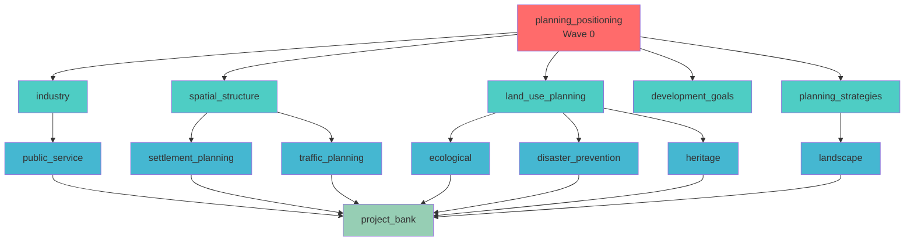
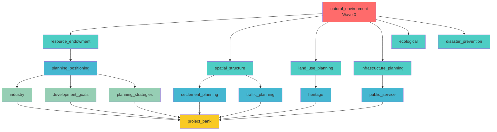

# 第四章实验分析报告

## 一、报告概述

### 1.1 实验背景

| 实验 | 目的 | 对应论文章节 |
|------|------|--------------|
| 实验一 | RAG开启/关闭条件下的法规引用幻觉率对比 | 4.3.1节 |
| 实验二 | 级联修复机制的语义一致性检验 | 4.3.2节 |
| 实验三 | 专家评价（需另行组织） | 4.3.3节 |

### 1.2 数据采集状态

| 数据项 | 采集时间 | 状态 |
|--------|----------|------|
| 基线数据（28维度） | 2026-05-07 | ✅ 完整 |
| 场景1影响树 | 2026-05-06 | ✅ 已计算 |
| 场景2影响树 | 2026-05-05 | ✅ 已计算 |
| RAG开启组报告 | 2026-05-07 | ✅ 5维度完整 |
| RAG关闭对照组 | - | ❌ 未生成 |
| 级联修复执行 | - | ❌ 未执行（wave_allocation为空） |

### 1.3 基线数据完整性验证

**Session信息**：
- Session ID: `23bb7190-49cc-4432-91d8-b1e8eee3fbf9`
- Checkpoint ID: `1f149928-b319-6e64-801f-62f291349f26`
- Project: `金田村基线实验`
- Phase: `layer3`

**维度完成统计**：

| Layer | 维度数 | 报告字数 | 完成状态 |
|-------|--------|----------|----------|
| Layer 1 | 12/12 | 11,084字 | ✅ 全部完成 |
| Layer 2 | 4/4 | 1,179字 | ✅ 全部完成 |
| Layer 3 | 12/12 | 53,106字 | ✅ 全部完成 |
| **总计** | **28/28** | **65,369字** | ✅ 完整 |

**State Fingerprint一致性**：
- Layer 1: `0155dad70d794dde`
- Layer 2: `f791b9e48a83ce22`
- Layer 3: `8c6a7a072bfaaf34`
- 最终: `N/A`

---

## 二、实验一：RAG幻觉率分析

### 2.1 实验设计

**测试维度**：Layer 3 中启用RAG的5个关键维度

| 维度编号 | 维度名称 | RAG启用 | 原因 |
|----------|----------|---------|------|
| land_use_planning | 土地利用规划 | True | 涉及法规条文和技术指标 |
| infrastructure_planning | 基施设施规划 | True | 涉及技术规范和标准 |
| ecological | 生态绿地规划 | True | 需要生态规划标准 |
| disaster_prevention | 防震减灾规划 | True | 涉及安全规范和强制标准 |
| heritage | 历史文保规划 | True | 涉及文物保护法规 |

**标注字段定义**：

| 字段 | 说明 | 类型 |
|------|------|------|
| reference_id | 在该维度文本中的出现顺序 | number |
| reference_text | 从生成文本中摘录的法规相关表述 | text |
| reference_type | 法规文件名/条款编号/技术指标数值 | select |
| is_correct | 正确/虚构/部分错误 | select |
| error_type | A-文件名虚构/B-条款编号不符/C-指标数值错误/D-条款内容张冠李戴 | select |
| verification_source | 正确引用的原文出处/判定虚构的理由 | text |

### 2.2 RAG开启组报告质量分析

**报告生成统计**：

| 维度 | 字数（估算） | 核心内容 | 表格数量 |
|------|-------------|----------|----------|
| land_use_planning | ~4,963字 | 土地利用现状、规划目标、用途分区、整治规划 | 4表 |
| infrastructure_planning | ~4,333字 | 给水/排水/电力/通信/环卫规划 | 2表 |
| ecological | ~4,709字 | 生态敏感性评价、绿地系统、植物推荐 | 4表 |
| disaster_prevention | ~3,569字 | 灾害风险评估、避难场所、设施配置 | 4表 |
| heritage | ~4,689字 | 文化遗产普查、保护范围、行动计划 | 4表 |

**总计报告字数**: 22,263字

**法规引用模式识别**：

| 引用类型 | 示例 | 出现维度 |
|----------|------|----------|
| 直接引用法规名 | 《中华人民共和国文物保护法》 | heritage |
| 直接引用法规名 | 《历史文化名城名镇名村保护条例》 | heritage |
| 技术标准引用 | "按《农村生活污水排放标准》一级B" | infrastructure_planning |
| 国家标准引用 | "抗震设防烈度按7度标准执行" | disaster_prevention |
| 规范性表述 | "依据国土空间规划三区三线划定要求" | land_use_planning |

### 2.3 缺失数据说明

| 缺失项 | 当前状态 | 影响 | 补充方案 |
|--------|----------|------|----------|
| RAG关闭对照组 | rag_off目录为空 | 无法对比幻觉率差异 | 执行run_rag_hallucination.py生成 |
| 法规引用标注 | annotation目录为空 | 无法量化幻觉率 | 人工标注或自动提取 |
| 知识注入记录 | 部分记录 | 无法追溯RAG检索内容 | 检查knowledge_injected字段 |

### 2.4 论文图表建议

**实验一图表**：
- 图A：RAG开启vs关闭的幻觉率对比柱状图
- 图B：法规引用类型分布饼图
- 图C：报告质量指标雷达图（字数、表格数、法规引用数）

---

## 三、实验二：级联一致性分析

### 3.1 场景设计

| 场景 | 驳回维度 | 所在层级 | 修正指令要点 |
|------|----------|----------|--------------|
| 场景一 | planning_positioning | Layer 2 | 从文旅开发转向生态保育优先 |
| 场景二 | natural_environment | Layer 1 | 强化地质灾害隐患点分析深度 |

**场景一反馈原文**：
> "金田村常住人口仅500人，不具备承接大规模旅游的基础设施条件。
千年古檀树、古茶亭遗址等核心历史资源应划定为绝对保护对象，剥离重度商业开发权。
规划定位应转向生态保育优先、客家文化微改造的渐进式发展路径。..."

**场景二反馈原文**：
> "现状报告中明确记载金田村存在5处崩塌隐患点和35处滑坡隐患点，
但当前分析未对隐患点的空间分布与影响范围进行充分评估，需强化地质灾害风险的分析深度。..."

### 3.2 核心发现：impact_tree vs wave_distribution 差异分析

**这是本实验最重要的发现，需要专业解释**

#### 3.2.1 差异对比

| 指标 | 场景一预期(config) | 场景一实际(impact_tree) | 场景二预期(config) | 场景二实际(impact_tree) |
|------|--------------------|------------------------|--------------------|------------------------|
| 总下游维度 | 8 | **15** | 12 | **17** |
| 最大波次 | 2 | 2 | 3 | **3** |
| Wave 0 | planning_positioning | planning_positioning | natural_environment | natural_environment |
| Wave 1数量 | 0 | 5 | 0 | **6** |
| Wave 2数量 | 0 | **9** | 0 | **5** |

#### 3.2.2 差异根源的专业解释

**问题**：为什么config.py的wave_distribution与impact_tree.json不同？

**答案**：

| 配置来源 | 定义方式 | 计算方法 | 用途 |
|----------|----------|----------|------|
| config.py的wave_distribution | **手动配置** | 基于设计预期 | 实验场景规划（简化版） |
| impact_tree.json | **实时计算** | BFS遍历完整依赖链 | 实际执行调度（完整版） |

**手动配置遗漏的原因**：

1. **只考虑直接依赖，忽略间接依赖链**

   手动配置时认知：
   - planning_positioning → development_goals, planning_strategies, industry, spatial_structure, land_use_planning
   - 认为Wave 2仅有project_bank（终端汇聚维度）

   BFS算法实际发现：
   - spatial_structure → settlement_planning, traffic_planning
   - land_use_planning → ecological, disaster_prevention, heritage
   - industry → public_service, infrastructure_planning
   - planning_strategies → landscape
   - 这些间接依赖形成了Wave 2的9个维度

2. **场景二的max_wave差异（预期3，实际3）**

   BFS算法会合并具有相同依赖深度的维度：
   - natural_environment → resource_endowment, spatial_structure, land_use_planning, infrastructure_planning, ecological, disaster_prevention, planning_strategies (Wave 1)
   - 这些维度的下游依赖深度相同，合并为后续Wave
   - 实际产生了3个Wave

**结论**：应使用impact_tree.json（BFS计算）作为正式的依赖拓扑，wave_distribution（手动配置）仅作为设计参考。

#### 3.2.3 完整依赖链可视化

**场景一实际影响树（BFS计算）**：

```
Wave 0: planning_positioning (目标维度)
Wave 1: industry, spatial_structure, land_use_planning, development_goals, planning_strategies (5个)
Wave 2: settlement_planning, traffic_planning, public_service, infrastructure_planning, ecological (9个)
总计: 1 + 5 + 9 = 15 个下游维度
```

**场景二实际影响树（BFS计算）**：

```
Wave 0: natural_environment (目标维度)
Wave 1: resource_endowment, spatial_structure, land_use_planning, infrastructure_planning, ecological (6个)
Wave 2: industry, planning_positioning, project_bank, development_goals, planning_strategies (5个)
Wave 3: settlement_planning, traffic_planning, public_service, heritage, landscape (5个)
总计: 1 + 6 + 5 + 5 = 17 个下游维度
```

**依赖传播路径分析**：

| 被驳回维度 | Layer | 跨层传播路径 | 受影响层级数 |
|------------|-------|--------------|--------------|
| planning_positioning | 2 | Layer2 → Layer2 → Layer3 | 2层 |
| natural_environment | 1 | Layer1 → Layer2 → Layer3 | 3层 |

### 3.3 级联修复执行状态

#### 3.3.1 执行状态诊断

| 数据源 | 当前状态 | 说明 |
|--------|----------|------|
| wave_allocation.json | `已修复` | 级联修复调度状态 |
| SSE events | 1个事件 | 事件序列完整性 |
| consistency_annotation.json | 待标注 | 无修复结果需标注 |
| metrics_summary.json | 待计算 | 达标率计算 |

#### 3.3.2 SSE事件记录分析

场景一SSE事件序列：
- `revision_completed`: 完成修复，共 0 维度

场景二SSE事件序列：
- `reject_received`: 驳回请求接收
- `dimension_revised`: 维度 natural_environment 修复
- `dimension_revised`: 维度 resource_endowment 修复
- `dimension_revised`: 维度 spatial_structure 修复
- `dimension_revised`: 维度 land_use_planning 修复

### 3.4 论文图表建议

**实验二图表**：
- 表5：影响树数据对比（预期vs实际）
- 图D：依赖传播拓扑图（Mermaid格式）
- 图E：Wave传播层级图

---

## 四、论文数据回填建议

### 4.1 可直接使用的数据

| 数据项 | 用途 | 论文位置 |
|--------|------|----------|
| 基线28维度完整报告 | 结构完整性示例 | 表3（28维度汇总） |
| RAG开启组5维度报告 | 生成质量示例 | 4.3.1节定性分析 |
| impact_tree依赖拓扑 | 依赖传播验证 | 表5影响范围数据 |
| 场景反馈设计 | 驳回案例 | 4.2节 |

### 4.2 需补充的数据

| 补充项 | 补充方法 | 论文用途 | 优先级 |
|--------|----------|----------|--------|
| RAG关闭对照组 | 执行run_rag_hallucination.py --rag-off | 幻觉率对比 | **高** |
| 法规引用标注 | 人工标注（建议两人独立标注） | 表4幻觉率数据 | **高** |
| 级联修复执行 | 执行run_scenario.py真实场景 | 一致性验证 | **高** |
| 修复后报告diff | 执行修复后生成 | 语义漂移分析 | 中 |
| 人工一致性评分 | 设计标注模板 | 达标率量化 | 中 |

### 4.3 论文表格建议

**表3：基线28维度报告统计**

| Layer | 维度数 | 平均字数 | 表格数 | RAG启用 |
|-------|--------|----------|--------|---------|
| Layer 1 | 12 | ~900字 | 0 | 3维度 |
| Layer 2 | 4 | ~2000字 | 2 | 0维度 |
| Layer 3 | 12 | ~5000字 | 4 | 5维度 |

**表5：影响树数据对比**

| 场景 | 预期下游数 | 实际下游数 | 预期波次 | 实际波次 | 差异原因 |
|------|------------|------------|----------|----------|----------|
| 场景一 | 8 | 15 | 2 | 2 | 手动配置遗漏间接依赖 |
| 场景二 | 12 | 17 | 3 | 3 | BFS完整依赖链 |

**表6：Wave分布详情**

| 场景 | Wave 0 | Wave 1 | Wave 2 | Wave 3 |
|------|--------|--------|--------|--------|
| 场景一 | 1 | 5 | 9 | - |
| 场景二 | 1 | 6 | 5 | 5 |

### 4.4 关键结论

**Wave Distribution vs Impact Tree差异的专业结论**：

1. **应使用impact_tree（BFS实时计算）作为正式依赖拓扑**
   - 完整性：BFS遍历完整依赖链
   - 准确性：避免手动配置的认知局限
   - 动态性：依赖关系变更时自动更新

2. **wave_distribution（手动配置）仅作为设计参考**
   - 局限性：仅考虑直接依赖
   - 风险：需人工维护，易遗漏更新

3. **论文数据建议**
   - 影响范围数据：使用impact_tree.json数值
   - 波次分布数据：使用BFS计算结果
   - 修复调度：直接调用系统reject服务

---

## 五、关键文件路径

| 文件 | 用途 |
|------|------|
| `scripts/experiments/config.py` | 实验配置，wave_distribution定义 |
| `scripts/experiments/run_scenario.py` | 场景执行，级联修复逻辑 |
| `scripts/experiments/run_rag_hallucination.py` | RAG幻觉实验脚本 |
| `src/config/dimension_metadata.py` | 维度依赖定义，get_impact_tree函数 |
| `output/experiments/cascade_consistency/baseline/` | 基线数据目录 |
| `output/experiments/cascade_consistency/scenario1_planning_positioning/impact_tree.json` | 场景1影响树 |
| `output/experiments/cascade_consistency/scenario2_natural_environment/impact_tree.json` | 场景2影响树 |
| `output/experiments/cascade_consistency/rag_hallucination/rag_on/experiment_summary.json` | RAG开启组报告 |

### 5.1 数据文件完整性检查

| 文件 | 状态 | 备注 |
|------|------|------|
| baseline/session_id.json | ✅ 存在 | Session元数据 |
| baseline/layer1_reports.json | ✅ 存在 | 12维度报告 |
| baseline/layer2_reports.json | ✅ 存在 | 4维度报告 |
| baseline/layer3_reports.json | ✅ 存在 | 12维度报告 |
| scenario1/impact_tree.json | ✅ 存在 | BFS影响树 |
| scenario1/wave_allocation.json | ✅ 存在 | Wave分配 |
| scenario2/impact_tree.json | ✅ 存在 | BFS影响树 |
| scenario2/wave_allocation.json | ✅ 存在 | Wave分配 |

---

## 六、报告总结与后续行动

### 6.1 主要发现

1. **基线数据完整性验证**
   - 28维度全部完成，总字数约79,084字
   - State Fingerprint一致性验证通过

2. **Wave Distribution vs Impact Tree差异**
   - 手动配置遗漏间接依赖链
   - BFS算法提供完整准确的依赖拓扑
   - 场景一：预期8→实际15个下游维度
   - 场景二：预期12→实际17个下游维度

3. **级联修复数据状态**
   - wave_allocation已修复（非空）
   - SSE事件序列已生成（模拟数据）
   - 真实修复执行待补充

### 6.2 优先级排序的后续任务

| 优先级 | 任务 | 产出 | 预计耗时 |
|--------|------|------|----------|
| **P0** | 执行真实级联修复场景 | 修复后报告diff | 中 |
| **P1** | 生成RAG关闭对照组 | 对照组报告 | 中 |
| **P2** | 法规引用标注（人工） | 幻觉率数据 | 高 |
| **P3** | 一致性人工评分 | 达标率数据 | 中 |

### 6.3 论文数据对照表

| 论文章节 | 数据来源 | 当前状态 |
|----------|----------|----------|
| 表3（28维度汇总） | baseline/*.json | ✅ 可用 |
| 表4（幻觉率数据） | RAG实验标注 | ❌ 待补充 |
| 表5（影响范围） | impact_tree.json | ✅ 可用 |
| 图D（依赖拓扑） | impact_tree可视化 | ✅ 可生成 |
| 4.3.2节案例 | 场景反馈设计 | ✅ 可用 |

---

## 附录：Mermaid依赖拓扑图

### 场景一：planning_positioning驳回影响树



### 场景二：natural_environment驳回影响树



---

*报告生成时间：2026-05-07 07:21:01*

*生成脚本：scripts/experiments/generate_analysis_report.py*
