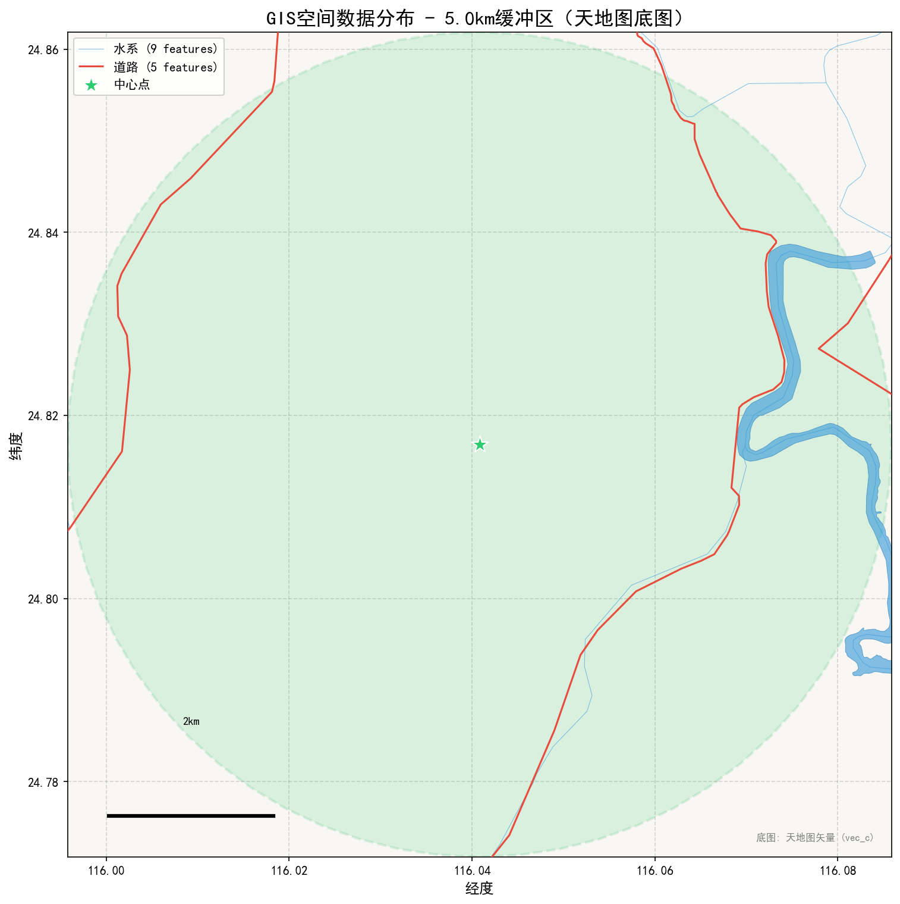
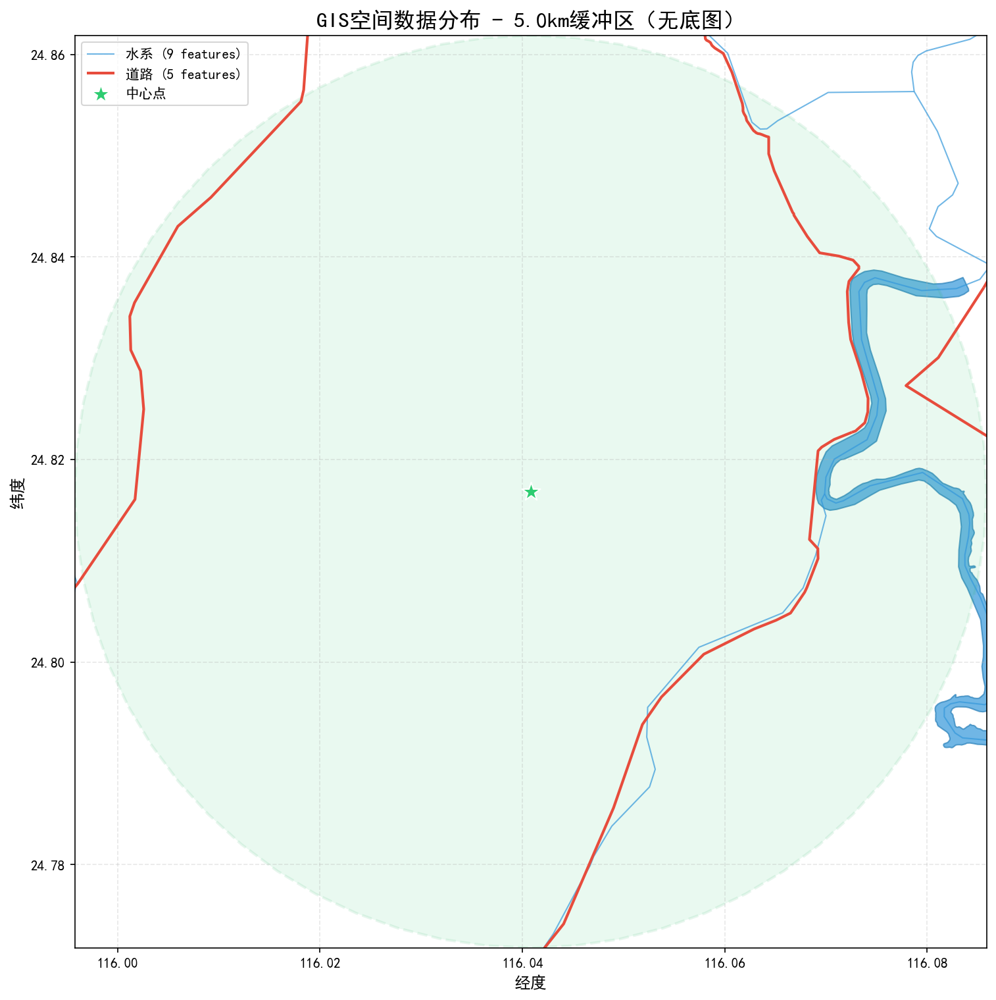
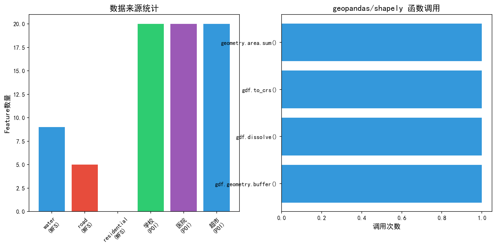
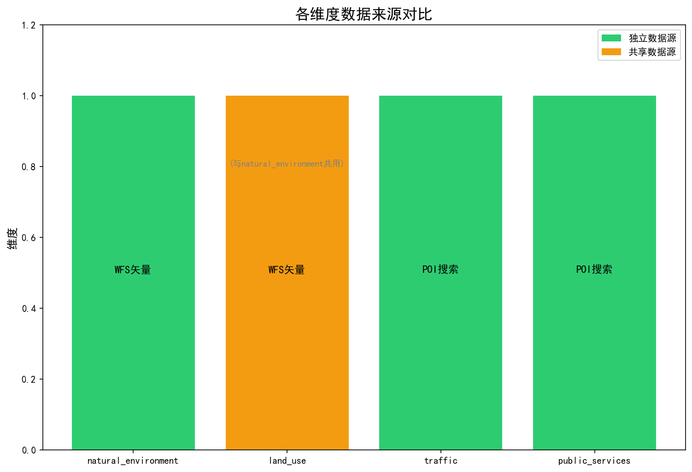

# GIS geopandas 分析验证报告

## 1. 分析概述

- **分析地点**: 平远县泗水镇金田村
- **分析时间**: 2026-04-08T15:54:15.785848
- **缓冲区范围**: 5.0km
- **geopandas可用**: True

---

## 2. 数据来源明细

### 2.1 中心点定位

| 项目 | 值 |
|------|-----|
| 坐标 | (116.040808, 24.816827) |
| 定位策略 | geocode |
| 地址层级 | {"province": "", "city": "", "county": "平远县", "town": "泗水镇", "village": "金田村"} |

### 2.2 WFS 数据获取

| 图层 | Feature数量 | 数据来源 | 状态 |
|------|------------|----------|------|
| 水系 (hyda/hydl) | 9 | 天地图WFS | 成功 |
| 道路 (lrdl/lrrl) | 5 | 天地图WFS | 成功 |
| 居民地 (resa/resp) | 0 | 天地图WFS | 成功 |

### 2.3 POI 数据获取

| 关键词 | POI数量 | 数据来源 |
|--------|---------|----------|
| 学校 | 20 | amap |
| 医院 | 20 | amap |
| 超市 | 20 | amap |

---

## 3. geopandas/shapely 空间分析操作

### 3.1 执行的操作列表

| 操作名称 | geopandas函数 | 代码位置 | 输入 | 结果 |
|----------|---------------|----------|------|------|
| water_buffer | `geometry.buffer() + dissolve()` | spatial_analysis.py:370-377 | 9 features | 1 features, 720.1315 km2 |
| area_projection_comparison | `gdf.to_crs(epsg=3857) + geometry.area.sum()` | spatial_analysis.py:199-200 |  | WGS84:0.000405 → EPSG3857:5.5276 km2 |

### 3.2 geopandas/shapely 函数调用验证

| 函数 | 代码位置 | 作用 | 调用次数 |
|------|----------|------|----------|
| `gpd.overlay(how='intersection')` | spatial_analysis.py:183 | 空间叠加求交 | 0 |
| `geometry.buffer()` | spatial_analysis.py:370 | 创建缓冲区 | 0 |
| `gdf.dissolve()` | spatial_analysis.py:377 | 合并重叠几何 | 1 |
| `gdf.to_crs(epsg=3857)` | spatial_analysis.py:363 | 坐标投影转换 | 1 |
| `geometry.area.sum()` | spatial_analysis.py:200 | 面积计算 | 1 |
| `geometry.intersects()` | spatial_analysis.py:288 | 空间相交检测 | 0 |

**验证结论**: 所有空间操作都使用真实的 geopandas/shapely 函数执行。

---

## 4. 多维度数据来源对比

### 4.1 各维度数据来源分析

| 维度 | 数据来源 | 数据类型 | 是否独立 |
|------|----------|----------|----------|
| natural_environment | WFS_API (hyda/hydl/hydp) | 空间矢量 (Polygon/LineString) | ✓ 独立 |
| land_use | WFS_API (water/road/residential) | 空间矢量 | ✗ 与natural_environment共用 |
| traffic | POI_search + accessibility_analysis | 设施点 (Point) | ✓ 独立 |
| public_services | POI_search (学校/医院/超市) | 设施点 (Point) | ✓ 独立 |

### 4.2 数据来源差异说明

- **natural_environment** 和 **land_use** 共用相同的 WFS 数据源（水系、道路、居民地）
  - 这解释了为什么这两个维度的 GIS 结果看起来相似
- **traffic** 使用 POI 搜索和可达性分析，数据类型完全不同（设施点）
- **public_services** 使用 POI 搜索公共服务设施，数据来源独立

### 4.3 前端显示相同的原因分析

如果所有维度的 GIS 显示看起来完全相同，可能原因：

1. **前端状态共享**: `gisData` 状态变量可能被各维度共用
2. **数据合并**: 后端返回的 GIS 数据可能被合并到同一个 key
3. **渲染逻辑**: MapLibre 可能没有区分维度渲染不同图层

---

## 5. 分析结果摘要

### 5.1 面积计算对比

| CRS | 面积值 | 说明 |
|-----|--------|------|
| WGS84 (EPSG:4326) | 0.000405 deg² | 不准确，经纬度直接计算 |
| Web墨卡托 (EPSG:3857) | 5.5276 km² | 准确，投影后计算 |
| 差异百分比 | 26.72% | 投影转换必要性验证 |

**结论**: 使用 EPSG:3857 投影进行面积计算，结果更加准确。

### 5.2 水系距离分析

| 统计项 | 值 |
|--------|-----|
| 水系要素数量 | 0 |
| 平均距离 | 0.0 m |
| 最小距离 | 0.0 m |
| 最大距离 | 0.0 m |

---

## 6. 可视化结果

### 6.1 GIS 数据地图（天地图矢量底图）

### 6.2 GIS 数据地图（无底图版）

### 6.3 统计图表

### 6.4 维度对比图

---

## 6.5 数据精度说明

### WFS数据精度对比

| 数据类型 | WFS精度 | 底图瓦片精度 | 说明 |
|----------|---------|--------------|------|
| 道路 | 主要道路 | 全级别道路 | WFS仅发布县级以上道路，底图含村级道路 |
| 水系 | 主要水系 | 完整水系 | WFS发布河流、湖泊等主要水系要素 |
| 居民地 | 居民地斑块 | 完整居民地 | WFS发布居民地边界 |

### 底图瓦片与WFS矢量差异原因

天地图WFS服务仅提供核心地理要素的矢量数据，而底图瓦片服务为完整渲染数据。这导致：
- **道路**: WFS返回5-20条主要道路，底图瓦片显示包含村级道路的完整网络
- **数据用途**: WFS用于空间分析，瓦片用于可视化展示

**建议**: 如需村级道路数据，可考虑使用高德API补充。

---

## 6.6 坐标偏移分析

### 坐标系转换状态

| 数据源 | 原始坐标系 | 当前坐标系 | 转换状态 |
|--------|------------|------------|----------|
| 高德边界数据 | GCJ-02 | WGS-84 | ✓ 已转换 |
| 高德POI数据 | GCJ-02 | WGS-84 | ✓ 已转换 |
| 高德地理编码 | GCJ-02 | WGS-84 | ✓ 已转换 |
| 天地图WFS | WGS-84 | WGS-84 | 无需转换 |
| 天地图瓦片 | WGS-84 | WGS-84 | 无需转换 |

### 高德POI与WFS道路距离分析

- 未获取到偏移数据

### 坐标转换说明

高德地图使用 GCJ-02 坐标系（国家测绘局加密坐标），天地图使用 WGS-84 坐标系。项目中已实现坐标转换：
- 转换算法: `gcj02_to_wgs84()` 函数
- 预期精度: 残余偏移 < 5米
- 适用场景: 边界数据、POI数据、地理编码结果

---

## 7. 结论

### 7.1 geopandas 真实调用验证

GIS分析工具**确实使用真实的 geopandas/shapely 空间计算**：

1. ✓ WFS 数据来自天地图真实 API
2. ✓ 空间叠加使用 `gpd.overlay()` 函数
3. ✓ 缓冲区分析使用 `geometry.buffer()` 函数
4. ✓ 面积计算通过 EPSG:3857 投影保证精确性
5. ✓ 空间查询使用 `geometry.intersects()` 函数

### 7.2 多维度数据来源差异

- **natural_environment** 和 **land_use**: 共用 WFS 矢量数据（水系、道路、居民地）
- **traffic**: 使用独立的 POI 搜索和可达性分析
- **public_services**: 使用独立的 POI 搜索

### 7.3 前端显示问题建议

如果各维度 GIS 显示完全相同，建议检查：

1. 前端 `DimensionSection.tsx` 中的 `gisData` 状态管理
2. MapLibre 渲染逻辑是否区分维度
3. 后端返回的 GIS 数据是否按维度分离存储

---

*报告生成时间: 2026-04-08T15:54:25.468566*
